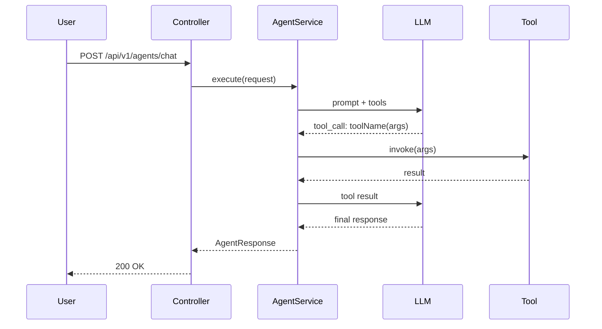
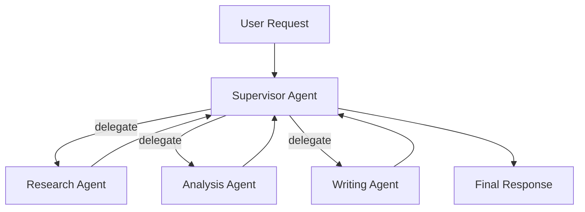

# Skill: Java AI Agents Engineering

## Purpose
This skill activates expert-level guidance for building production-grade AI agents in Java using Spring AI and LangChain4j. Reference it whenever creating modules, agents, tools, or infra in this masterclass repo.

## Skill Triggers
Use this skill when:
- Creating a new module (`0X-name/`)
- Implementing an agent (ReAct, tool-calling, RAG, multi-agent)
- Adding API management concerns (auth, rate limiting, tracing)
- Designing a multi-agent supervisor system
- Writing module READMEs or Mermaid diagrams

## Module Creation Checklist
When scaffolding a new module, produce in order:
1. Module `README.md` with: learning objectives, architecture Mermaid diagram, prerequisites, run instructions, common pitfalls
2. `pom.xml` inheriting parent
3. `application.yml` with profiles (`local`, `cloud`)
4. `docker-compose.yml` if infra is needed
5. Domain model (records / entities)
6. Tool classes annotated with `@Tool` (descriptive `description` fields)
7. Agent service using `ChatClient` with appropriate advisors
8. REST controller with full API management stack
9. Unit tests (mocked LLM) + integration test skeleton

## Agent Implementation Patterns

### ReAct Agent (Reason + Act)
```java
ChatClient.builder(chatModel)
    .defaultAdvisors(new SimpleLoggerAdvisor())
    .build()
    .prompt()
    .system(systemPrompt)
    .user(userMessage)
    .tools(toolList)
    .call()
    .content();
```

### RAG Agent
```java
ChatClient.builder(chatModel)
    .defaultAdvisors(
        new QuestionAnswerAdvisor(vectorStore, SearchRequest.defaults()),
        new MessageChatMemoryAdvisor(chatMemory)
    )
    .build();
```

### Multi-Agent Supervisor
- Supervisor holds references to sub-agent services
- Supervisor uses tool-calling to delegate: each sub-agent exposes a `@Tool`-annotated method
- Sub-agents never call each other

## Mermaid Diagram Templates

### Agent Flow (Sequence)


### Multi-Agent (Flowchart)


## API Management Stack (apply to every controller)

```java
@RestController
@RequestMapping("/api/v1/agents")
@Tag(name = "Agent API", description = "...")
public class AgentController {

    // 1. Authenticated via JwtAuthFilter (Spring Security)
    // 2. Rate limited via Bucket4jRateLimitFilter
    // 3. Traced via OpenTelemetry auto-instrumentation

    @PostMapping("/chat")
    @Operation(summary = "Chat with the agent")
    public ResponseEntity<AgentResponse> chat(
            @Valid @RequestBody AgentRequest request,
            @AuthenticationPrincipal UserDetails user) {
        // delegate to AgentService
    }
}
```

## Common Pitfalls (document in every module README)
- Tool descriptions must be LLM-readable, not developer-readable
- Never put business logic in `@Tool` methods — they call services
- Spring AI `ChatMemory` is in-memory by default; wire Redis for multi-instance deployments
- Embeddings are expensive — cache them; do not re-embed stable corpora on startup
- Structured output parsing fails silently if the prompt doesn't reinforce the schema — always include schema hint in system prompt
- Rate limit state must be in Redis for horizontal scaling; local Bucket4j state breaks under load balancing
