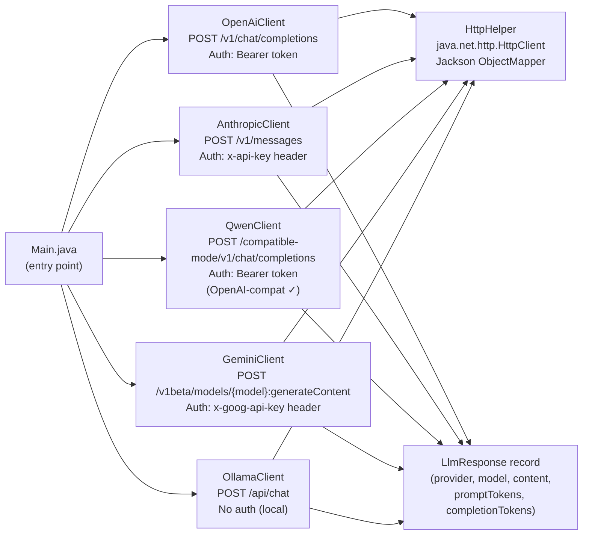

# 00 — LLM API Basics (No Framework)

> **Goal:** connect to five different LLM providers using nothing but Java 21's built-in
> `java.net.http.HttpClient` and Jackson. No Spring, no Spring AI, no LangChain4j.

---

## Learning Objectives

- Understand the raw HTTP contract that every LLM provider exposes
- See why **OpenAI-compatible endpoints** (Qwen, Together AI, Groq, Ollama, etc.) need only a URL swap
- Identify the structural differences between OpenAI, Anthropic, and Gemini response shapes
- Know what Spring AI's `ChatClient` is abstracting away for you

---

## Prerequisites

- Java 21+
- Maven 3.9+
- API keys for whichever providers you want to test (see `.env.example`)
- For Ollama: Docker or a local Ollama install + `ollama pull llama3.2`

---

## Architecture



---

## Provider Cheat Sheet

| Provider | Endpoint pattern | Auth header | Body format | Response path |
|---|---|---|---|---|
| **OpenAI** | `POST /v1/chat/completions` | `Authorization: Bearer KEY` | `messages[{role,content}]` | `choices[0].message.content` |
| **Anthropic** | `POST /v1/messages` | `x-api-key: KEY` + `anthropic-version` | `messages[]` + `max_tokens` | `content[0].text` |
| **Qwen** (DashScope) | `POST /compatible-mode/v1/chat/completions` | `Authorization: Bearer KEY` | identical to OpenAI | identical to OpenAI |
| **Gemini** | `POST /v1beta/models/{model}:generateContent` | `x-goog-api-key: KEY` | `contents[{parts[{text}]}]` | `candidates[0].content.parts[0].text` |
| **Ollama** | `POST /api/chat` | none | `messages[]` + `"stream":false` | `message.content` |

---

## Key Concepts

### Why the body differs per provider

OpenAI published their API spec first and it became the de-facto standard.
Providers like Qwen, Together AI, Groq, and Ollama adopted an **OpenAI-compatible mode**:
same URL structure, same JSON body, same response shape — just a different base URL and key.

Anthropic and Google chose their own schemas (different auth headers, different nesting).
This is exactly why Spring AI exists: it normalizes all these differences behind one `ChatClient` interface.

### What Spring AI does for you

When you write `ChatClient.builder(chatModel).build().prompt().user("hello").call().content()`:

1. It serializes your message into the provider-specific JSON body
2. It sets the correct auth headers for that provider
3. It deserializes the response and extracts the text
4. It records token usage metrics
5. It retries on transient errors
6. It propagates OpenTelemetry trace context

This module shows you steps 1–3 by hand, so you understand what the framework automates.

### OpenAI-compatible providers (easy to add)

Any provider with an OpenAI-compat endpoint needs only three changes from `OpenAiClient`:

```java
// Groq
private static final String ENDPOINT = "https://api.groq.com/openai/v1/chat/completions";
// Together AI
private static final String ENDPOINT = "https://api.together.xyz/v1/chat/completions";
// DeepSeek
private static final String ENDPOINT = "https://api.deepseek.com/v1/chat/completions";
// Ollama (OpenAI-compat mode)
private static final String ENDPOINT = "http://localhost:11434/v1/chat/completions";
```

---

## How to Run

```bash
# 1. Set your keys (or export from your shell)
cp .env.example .env        # fill in the keys
source .env                 # or export each individually

# 2. Build
cd 00-llm-api-basics
mvn package -DskipTests

# 3. Run all providers
mvn exec:java -Dexec.mainClass=com.masterclass.llmbasics.Main

# 4. Run tests (no real API calls)
mvn test
```

Skip any provider by not setting its env var — the demo prints `[SKIP]` and continues.

---

## Code Walkthrough

| File | What it teaches |
|---|---|
| `common/HttpHelper.java` | `java.net.http.HttpClient` POST with JSON body and headers |
| `common/LlmResponse.java` | Java record as a unified return type across providers |
| `openai/OpenAiClient.java` | The OpenAI "messages" schema — the industry baseline |
| `anthropic/AnthropicClient.java` | Custom headers (`x-api-key`, `anthropic-version`), `max_tokens` requirement |
| `qwen/QwenClient.java` | OpenAI-compat: identical body, different base URL and key |
| `gemini/GeminiClient.java` | Completely different body (`contents[].parts[]`) and auth approach |
| `ollama/OllamaClient.java` | Local inference, no auth, `stream:false` for single-shot response |
| `Main.java` | Env-var-driven provider selection, graceful skipping |

---

## Common Pitfalls

- **Anthropic missing `max_tokens`**: the API returns HTTP 400 if you omit it — it's required, unlike OpenAI
- **Gemini model in URL**: the model is part of the path (`/models/gemini-2.0-flash:generateContent`), not in the body
- **Ollama `stream: false`**: omitting this gives you NDJSON (one JSON object per line), not a single response
- **Qwen model names**: `qwen-turbo` / `qwen-plus` / `qwen-max` — not `gpt-*` names, even though the endpoint is compat
- **Never commit `.env`**: add it to `.gitignore` — use `.env.example` as the template

---

## Further Reading

- [OpenAI Chat Completions API](https://platform.openai.com/docs/api-reference/chat)
- [Anthropic Messages API](https://docs.anthropic.com/en/api/messages)
- [Qwen DashScope OpenAI-compat docs](https://www.alibabacloud.com/help/en/model-studio/developer-reference/use-qwen-by-calling-api)
- [Gemini REST API](https://ai.google.dev/api/generate-content)
- [Ollama API reference](https://github.com/ollama/ollama/blob/main/docs/api.md)

---

## What's Next

→ **[01-hello-agent](../01-hello-agent/README.md)** — build your first agent with Spring AI's `ChatClient`,
  which wraps everything you just did manually into a clean fluent API with auth, rate limiting, and tracing built in.
