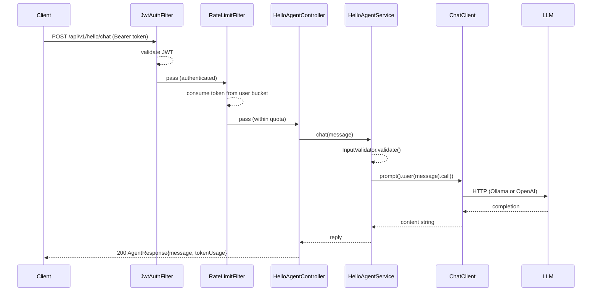

# Module 01 — Hello Agent

> **Prerequisite**: complete [00-prerequisites](../00-prerequisites/README.md) and verify `docker compose up` succeeds at the repo root.

## Learning Objectives

- Understand the difference between `ChatModel` (low-level) and `ChatClient` (fluent, high-level) in Spring AI.
- Expose an LLM-backed endpoint with JWT auth, rate limiting, and OpenAPI docs from day one.
- Switch between local (Ollama) and cloud (OpenAI) providers using Maven profiles — zero code change.
- Recognise the role of the `shared/` module as the source of truth for all API management concerns.

## Prerequisites

| Requirement | Check |
|---|---|
| JDK 21+ | `java -version` |
| Maven 3.9+ | `./mvnw -version` |
| Docker + Compose | `docker compose version` |
| Ollama + llama3.1 | `curl localhost:11434/api/tags` |

## Architecture



## Key Concepts

### ChatModel vs ChatClient
`ChatModel` is the low-level interface: `model.call(new Prompt(...))`. It gives you full control but requires manual prompt assembly. `ChatClient` wraps it in a fluent builder API and supports advisors, system prompts, and structured output without boilerplate. **Always use `ChatClient` unless you have a specific reason to go lower.**

### Profile-driven provider switching
Spring AI reads `spring.ai.openai.*` or `spring.ai.ollama.*` from `application-{profile}.yml`. The `-Plocal` Maven profile activates `application-local.yml` which suppresses the OpenAI autoconfiguration — meaning the same code talks to Ollama locally and OpenAI in CI/production without a single conditional.

### The shared/ module is not optional
Every module depends on `shared/`. It contributes `JwtAuthFilter`, `RateLimitFilter`, `SecurityConfig`, `OpenApiConfig`, and `InputValidator` via `@ComponentScan`. You do not wire these manually in each module.

## How to Run

```bash
# Start infrastructure (from repo root)
docker compose up -d

# Pull the model if not already pulled
docker exec masterclass-ollama ollama pull llama3.1

# Run module 01 with local Ollama (default profile)
./mvnw -pl 01-hello-agent spring-boot:run

# Run with OpenAI (requires OPENAI_API_KEY in environment)
OPENAI_API_KEY=sk-... ./mvnw -pl 01-hello-agent spring-boot:run -Pcloud
```

### Get a JWT token (test user)

```bash
# The module ships with a test endpoint — DO NOT ship this in production modules
curl -X POST http://localhost:8080/api/v1/auth/token \
  -H "Content-Type: application/json" \
  -d '{"username":"demo","password":"demo"}'
```

### Call the agent

```bash
curl -X POST http://localhost:8080/api/v1/hello/chat \
  -H "Authorization: Bearer <your-jwt>" \
  -H "Content-Type: application/json" \
  -d '{"message":"What is Spring AI and why should I care?"}'
```

OpenAPI UI: [http://localhost:8080/swagger-ui.html](http://localhost:8080/swagger-ui.html)

## Code Walkthrough

| File | Purpose |
|---|---|
| `HelloAgentApplication.java` | Spring Boot entry point; `@ComponentScan` includes `shared/` |
| `HelloAgentService.java` | Builds `ChatClient` with a system prompt; calls it; falls back on Resilience4j retry exhaustion |
| `HelloAgentController.java` | REST layer; validates `AgentRequest`; delegates to service |
| `langchain4j/HelloAgentLc4j.java` | Same behaviour, raw LangChain4j API — for comparison |
| `application.yml` | Shared defaults (rate limits, JWT config, actuator endpoints) |
| `application-local.yml` | Suppresses OpenAI autoconfiguration |
| `application-cloud.yml` | Suppresses Ollama autoconfiguration |

## Common Pitfalls

- **`JWT_SECRET` too short**: HS256 requires a key of at least 32 bytes. The default `change-me-...` is intentionally that long for local use; change it before any deployment.
- **Ollama not responding**: `docker compose ps` — the `masterclass-ollama` container must be healthy before the app starts, or the first call will time out. The Resilience4j retry handles transient failures but not a completely unavailable service.
- **Both OpenAI and Ollama autoconfigured**: if you forget to exclude one provider, Spring Boot may fail to resolve the `ChatModel` bean due to ambiguity. The profile-specific `spring.ai.autoconfigure.exclude` in each `application-{profile}.yml` prevents this.
- **Rate limit state lost on restart**: the Phase 1 `RateLimitFilter` uses an in-process `ConcurrentHashMap`. Restarting the app resets all buckets. Module 07 replaces this with Redis-backed state.

## Further Reading

- [Spring AI ChatClient docs](https://docs.spring.io/spring-ai/reference/api/chatclient.html)
- [Spring AI Ollama integration](https://docs.spring.io/spring-ai/reference/api/chat/ollama-chat.html)
- [Bucket4j rate limiting guide](https://bucket4j.com/8.10.1/toc.html)
- [JJWT library](https://github.com/jwtk/jjwt)

## What's Next

[Module 02 — Prompt Engineering](../02-prompt-engineering/README.md): `PromptTemplate`, few-shot patterns, and resource-backed system prompts.
