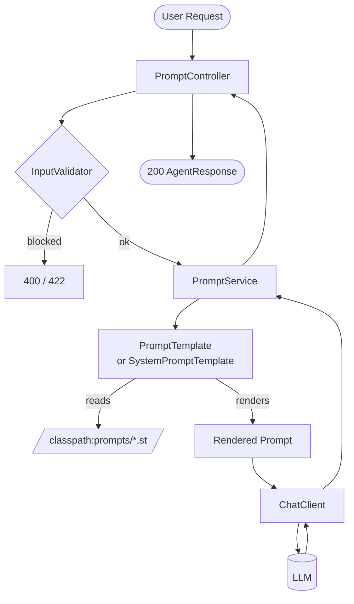

# Module 02 — Prompt Engineering

> **Prerequisite**: [Module 01 — Hello Agent](../01-hello-agent/README.md)

## Learning Objectives

- Use `PromptTemplate` and `SystemPromptTemplate` to separate prompt logic from Java code.
- Load prompt templates from classpath resources (`.st` files) so they can be edited without recompiling.
- Apply few-shot examples inside a template to guide LLM output format.
- Use role prompting (system message persona) to change the LLM's behaviour per endpoint.
- Understand why user-supplied text must be inserted as a variable, never string-concatenated — and how the `InputValidator` guardrail from `shared/` prevents basic injection.

## Prerequisites

- Module 01 running: `./mvnw -pl 01-hello-agent spring-boot:run`
- `docker compose up -d` at repo root

## Architecture



## Key Concepts

### Resource-backed prompt templates
Hard-coding prompts in Java strings makes them hard to version, test, and hand to non-developers for tuning. Spring AI's `PromptTemplate` accepts a `Resource` — any Spring resource, including `ClassPathResource`. The `.st` (StringTemplate) format uses `{variableName}` for substitution.

```java
var template = new PromptTemplate(new ClassPathResource("prompts/summarize.st"));
var prompt = template.create(Map.of("text", userInput, "maxWords", 150));
```

### System vs user messages
The system message sets the LLM's persona and constraints for the conversation. The user message is the actual task. `SystemPromptTemplate` works like `PromptTemplate` but renders into a `SystemMessage` rather than a `UserMessage`.

```java
var systemMsg = new SystemPromptTemplate(systemExpertTemplate)
    .createMessage(Map.of("domain", "Java", "yearsExperience", 15, "audienceLevel", "beginner"));

chatClient.prompt()
    .system(systemMsg.getContent())
    .user(question)
    .call()
    .content();
```

### Few-shot prompting
The `classify-sentiment.st` template includes labelled examples directly in the prompt. The LLM learns from the pattern rather than from fine-tuning. Few-shot works best when: output format must be strict, the task is ambiguous without examples, and you cannot afford a fine-tuned model.

### LangChain4j typed AiService (comparison)
LangChain4j's `@SystemMessage` / `@UserMessage` annotations on a Java interface let you declare prompts at the method signature level — no runtime `Map.of(...)` required, and IDEs can find usages.

```java
public interface TextProcessingService {
    @SystemMessage("You are a professional summarizer. Max {{maxWords}} words.")
    @UserMessage("Summarize:\n\n{{text}}")
    String summarize(@V("text") String text, @V("maxWords") int maxWords);
}
// Zero implementation — LangChain4j generates it via AiServices.builder(...)
```

**Use LangChain4j typed services when**: the prompt set is stable and type-safety matters more than runtime configurability.  
**Use Spring AI `PromptTemplate`** when: prompts need to be swapped at runtime, loaded from a database, or A/B tested.

## How to Run

```bash
# Start infra (repo root)
docker compose up -d

# Run module 02 (local Ollama, default profile)
./mvnw -pl 02-prompt-engineering spring-boot:run

# With OpenAI
OPENAI_API_KEY=sk-... ./mvnw -pl 02-prompt-engineering spring-boot:run -Pcloud
```

### Example requests

```bash
# Get a JWT first (from module 01 auth endpoint or a test token)
TOKEN="<your-jwt>"

# Summarize
curl -X POST http://localhost:8080/api/v1/prompts/summarize \
  -H "Authorization: Bearer $TOKEN" \
  -H "Content-Type: application/json" \
  -d '{"text":"Spring AI is a framework that abstracts over multiple LLM providers...","maxWords":50}'

# Translate
curl -X POST http://localhost:8080/api/v1/prompts/translate \
  -H "Authorization: Bearer $TOKEN" \
  -H "Content-Type: application/json" \
  -d '{"text":"Hello world","sourceLanguage":"English","targetLanguage":"Japanese"}'

# Sentiment (few-shot)
curl -X POST http://localhost:8080/api/v1/prompts/classify-sentiment \
  -H "Authorization: Bearer $TOKEN" \
  -H "Content-Type: application/json" \
  -d '{"message":"I absolutely love this product!"}'

# Role prompting
curl -X POST http://localhost:8080/api/v1/prompts/ask-expert \
  -H "Authorization: Bearer $TOKEN" \
  -H "Content-Type: application/json" \
  -d '{"domain":"distributed systems","audienceLevel":"intermediate","yearsExperience":20,"question":"Explain the CAP theorem"}'
```

## Code Walkthrough

| File | Purpose |
|---|---|
| `prompts/summarize.st` | Template with `{text}` and `{maxWords}` variables — edit prompts without recompiling |
| `prompts/translate.st` | Template for translation with source/target language variables |
| `prompts/classify-sentiment.st` | Few-shot template — contains labelled examples baked in |
| `prompts/system-expert.st` | System message template for role prompting |
| `PromptService.java` | Renders templates, calls `ChatClient`, applies `InputValidator` |
| `PromptController.java` | Four endpoints — each demonstrating a different prompt pattern |
| `langchain4j/TextProcessingService.java` | Same functionality via LangChain4j typed `AiService` interface |
| `langchain4j/TextProcessingServiceConfig.java` | Wires `OllamaChatModel` + `AiServices.builder(...)` as a Spring bean |
| `PromptTemplateRenderTest.java` | Verifies `.st` file rendering without calling the LLM — catches typos at build time |

## Common Pitfalls

- **String concatenation instead of template variables**: `"Summarize: " + userInput` passes user text directly into the prompt structure, enabling prompt injection. Always use `{variable}` substitution so user content is treated as data, not as prompt instructions.
- **Template variable name mismatch**: if `Map.of("txt", ...)` is passed but the template uses `{text}`, Spring AI throws at runtime. `PromptTemplateRenderTest` catches this at build time without LLM calls.
- **System message ordering**: some models are sensitive to the order of messages. Spring AI sends system before user messages by default — don't manually prepend system content to the user message.
- **Few-shot token cost**: each example in the few-shot template adds to the prompt token count on every request. Keep examples short; remove them once the model reliably returns the right format.
- **LangChain4j `@V` vs `{{` variable syntax**: LangChain4j uses `{{variableName}}` in annotation strings (double braces), while Spring AI `.st` files use single braces `{variableName}`. Mixing them is a common mistake when switching between the two.

## Further Reading

- [Spring AI PromptTemplate reference](https://docs.spring.io/spring-ai/reference/api/prompt.html)
- [LangChain4j AiServices](https://docs.langchain4j.dev/tutorials/ai-services)
- [Anthropic prompt engineering guide](https://docs.anthropic.com/en/docs/build-with-claude/prompt-engineering/overview)
- [Few-shot prompting — academic survey](https://arxiv.org/abs/2005.14165)

## What's Next

[Module 03 — Structured Output](../03-structured-output/README.md): force the LLM to return typed Java records using `BeanOutputConverter`, and handle parse failures gracefully.
