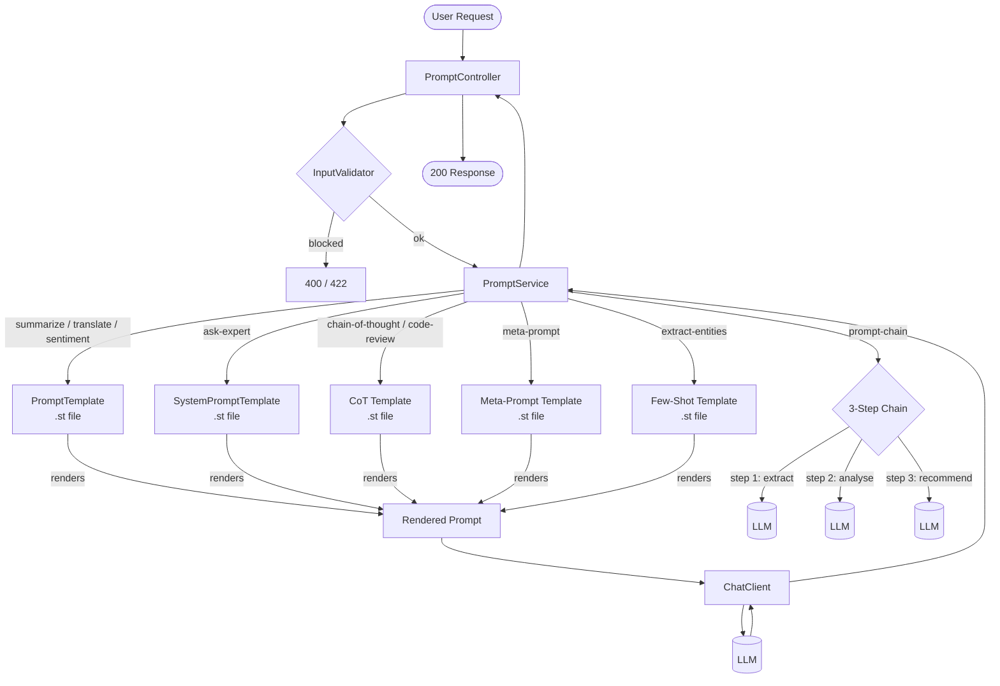
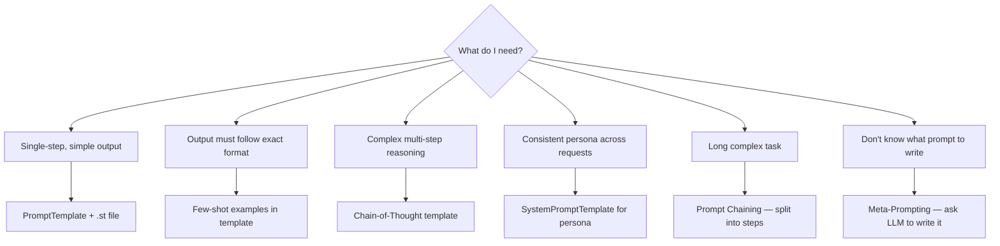

# Module 02 — Prompt Engineering

> **Prerequisite**: [Module 01 — Hello Agent](../01-hello-agent/README.md)

## Learning Objectives

- Use `PromptTemplate` and `SystemPromptTemplate` to separate prompt logic from Java code.
- Load prompt templates from classpath resources (`.st` files) so they can be edited without recompiling.
- Apply **few-shot examples** inside a template to teach the LLM a precise output format.
- Use **role prompting** (system message persona) to change the LLM's behaviour per endpoint.
- Apply **Chain-of-Thought (CoT)** prompting to improve accuracy on complex reasoning tasks.
- Use **meta-prompting** to have the LLM generate prompt templates for you.
- Build **prompt chains**: sequential LLM calls where each step's output feeds the next.
- Understand why user-supplied text must be a variable, never string-concatenated (prompt injection prevention).

## Prerequisites

- Module 01 running: `./mvnw -pl 01-hello-agent spring-boot:run`
- `docker compose up -d` at repo root

## Architecture



### Prompt Pattern Decision Tree



## Key Concepts

### Resource-backed prompt templates
Hard-coding prompts in Java strings makes them hard to version, test, and hand to non-developers for tuning. Spring AI's `PromptTemplate` accepts a `Resource` — any Spring resource, including `ClassPathResource`. The `.st` (StringTemplate) format uses `{variableName}` for substitution.

```java
var template = new PromptTemplate(new ClassPathResource("prompts/summarize.st"));
var prompt = template.create(Map.of("text", userInput, "maxWords", 150));
```

### System vs user messages
The system message sets the LLM's persona and constraints for the conversation. The user message is the actual task. `SystemPromptTemplate` works like `PromptTemplate` but renders into a `SystemMessage` rather than a `UserMessage`.

```java
var systemMsg = new SystemPromptTemplate(systemExpertTemplate)
    .createMessage(Map.of("domain", "Java", "yearsExperience", 15, "audienceLevel", "beginner"));

chatClient.prompt()
    .system(systemMsg.getContent())
    .user(question)
    .call()
    .content();
```

### Few-shot prompting
The `classify-sentiment.st` and `few-shot-entity-extract.st` templates include labelled input/output examples directly in the prompt. The LLM infers the output format from the pattern — no fine-tuning required. Few-shot works best when: the output format must be strict, the task is ambiguous without examples, and you cannot afford a fine-tuned model.

```
Input: "I absolutely love this product!"  → POSITIVE
Input: "Worst purchase I've ever made."   → NEGATIVE
Input: "It arrived on time."              → NEUTRAL

Input: "{text}"  →
```

### Chain-of-Thought (CoT) prompting
CoT forces the LLM to externalise its reasoning before producing an answer. Adding "Think step by step" to any prompt is the simplest form. This module uses a structured CoT template that labels each step (`Step 1: Understand`, `Step 2: Identify`, etc.) so the output is consistent and auditable.

**Why it works**: language models predict the next token — if the preceding tokens are correct reasoning steps, the final answer token is more likely to be correct. CoT effectively shifts probability mass from wrong answers to right ones by conditioning on intermediate reasoning.

```
Problem: A train leaves at 9am travelling at 60 mph. Another leaves at 11am at 80 mph.
When does the second train overtake the first?

Step 1: Understand the problem → relative speeds, gap to close...
Step 2: Identify knowns → speed1=60, speed2=80, head-start=2h×60=120 miles...
Step 3: Approach → gap / relative speed = 120/(80-60) = 6 hours after 11am = 5pm
Final Answer: 5:00 PM
```

### Meta-prompting
Meta-prompting uses the LLM as a prompt engineer. You describe the use case in plain English and get back a structured prompt template. This is the fastest way to bootstrap high-quality prompts for new use cases — especially when you're unsure of the best framing.

```
POST /api/v1/prompts/meta-prompt
{ "useCase": "customer support agent for a SaaS product",
  "targetAudience": "non-technical end users" }

→ LLM generates: system prompt, user template, usage notes
```

### Prompt chaining
A single LLM call degrades in quality as the task grows longer. Prompt chaining breaks the work into focused steps, where each call's output becomes the next call's input. This module implements a three-step chain:

```
Input document
    │
    ▼ Step 1 — Extract (cheap model ok)
Key facts list
    │
    ▼ Step 2 — Analyse (needs reasoning ability)
Implications and patterns
    │
    ▼ Step 3 — Synthesise (needs writing quality)
Actionable recommendations
```

Benefits: each step is independently debuggable, you can use different models per step, and shorter prompts produce more reliable outputs.

### LangChain4j typed AiService (comparison)
LangChain4j's `@SystemMessage` / `@UserMessage` annotations on a Java interface let you declare prompts at the method signature level — no runtime `Map.of(...)` required, IDEs can find usages, and the interface is unit-testable with a mock.

```java
public interface TextProcessingService {
    @SystemMessage("You are a professional summarizer. Max {{maxWords}} words.")
    @UserMessage("Summarize:\n\n{{text}}")
    String summarize(@V("text") String text, @V("maxWords") int maxWords);
}
// Zero implementation — LangChain4j generates it via AiServices.builder(...)
```

**Use LangChain4j typed services when**: the prompt set is stable and type-safety matters more than runtime flexibility.  
**Use Spring AI `PromptTemplate`** when: prompts need to be hot-swapped at runtime, loaded from a database, or A/B tested.

## How to Run

```bash
# Start infra (repo root)
docker compose up -d

# Run module 02 (local Ollama, default profile)
./mvnw -pl 02-prompt-engineering spring-boot:run

# With OpenAI
OPENAI_API_KEY=sk-... ./mvnw -pl 02-prompt-engineering spring-boot:run -Pcloud
```

### Example requests

```bash
TOKEN="<your-jwt>"   # from module 01 or a test JWT

# Summarize (basic template)
curl -X POST http://localhost:8080/api/v1/prompts/summarize \
  -H "Authorization: Bearer $TOKEN" -H "Content-Type: application/json" \
  -d '{"text":"Spring AI abstracts over multiple LLM providers...","maxWords":50}'

# Sentiment classification (few-shot)
curl -X POST http://localhost:8080/api/v1/prompts/classify-sentiment \
  -H "Authorization: Bearer $TOKEN" -H "Content-Type: application/json" \
  -d '{"message":"I absolutely love this product!"}'

# Role prompting
curl -X POST http://localhost:8080/api/v1/prompts/ask-expert \
  -H "Authorization: Bearer $TOKEN" -H "Content-Type: application/json" \
  -d '{"domain":"distributed systems","audienceLevel":"intermediate","yearsExperience":20,"question":"Explain the CAP theorem"}'

# Chain-of-thought reasoning
curl -X POST http://localhost:8080/api/v1/prompts/chain-of-thought \
  -H "Authorization: Bearer $TOKEN" -H "Content-Type: application/json" \
  -d '{"problem":"If I have 3 apples and give away half, then buy 5 more, how many do I have?"}'

# Structured code review
curl -X POST http://localhost:8080/api/v1/prompts/code-review \
  -H "Authorization: Bearer $TOKEN" -H "Content-Type: application/json" \
  -d '{"code":"String q = \"SELECT * FROM users WHERE name=\" + name;","language":"java"}'

# Meta-prompting: generate a prompt for a new use case
curl -X POST http://localhost:8080/api/v1/prompts/meta-prompt \
  -H "Authorization: Bearer $TOKEN" -H "Content-Type: application/json" \
  -d '{"useCase":"legal contract summariser for non-lawyers","targetAudience":"small business owners"}'

# Few-shot entity extraction
curl -X POST http://localhost:8080/api/v1/prompts/extract-entities \
  -H "Authorization: Bearer $TOKEN" -H "Content-Type: application/json" \
  -d '{"message":"Tim Cook announced Apple Vision Pro at WWDC in Cupertino on June 5th 2023."}'

# Prompt chaining
curl -X POST http://localhost:8080/api/v1/prompts/prompt-chain \
  -H "Authorization: Bearer $TOKEN" -H "Content-Type: application/json" \
  -d '{"input":"<paste any long article>","analysisContext":"a Java developer audience","audience":"senior engineers"}'
```

## Code Walkthrough

| File | Pattern | Purpose |
|------|---------|---------|
| `prompts/summarize.st` | Basic template | `{text}` and `{maxWords}` variables |
| `prompts/translate.st` | Basic template | Source/target language substitution |
| `prompts/classify-sentiment.st` | Few-shot | Labelled examples teach output format |
| `prompts/system-expert.st` | Role prompting | System message sets persona |
| `prompts/chain-of-thought.st` | CoT | Structured step-by-step reasoning |
| `prompts/code-review-chain.st` | CoT specialised | Enforces understand→issues→security→fix→priority |
| `prompts/meta-prompt.st` | Meta-prompting | LLM generates a prompt for your use case |
| `prompts/few-shot-entity-extract.st` | Few-shot | 3 examples teach JSON entity extraction |
| `PromptService.java` | — | All prompt rendering logic; 8 methods |
| `PromptController.java` | — | 8 REST endpoints, one per pattern |
| `langchain4j/TextProcessingService.java` | — | Same patterns via LangChain4j typed `AiService` |
| `PromptTemplateRenderTest.java` | — | Verifies all `.st` files without LLM — runs in CI |

## Common Pitfalls

- **String concatenation instead of template variables**: `"Summarize: " + userInput` enables prompt injection. Always use `{variable}` substitution — user text becomes data, not instructions.
- **Template variable name mismatch**: `Map.of("txt", ...)` vs `{text}` in the template throws at runtime. `PromptTemplateRenderTest` catches this at build time without LLM calls.
- **CoT on simple tasks is wasteful**: CoT adds 200–500 tokens to every request. Only apply it to tasks that genuinely need multi-step reasoning. Use basic templates for classification and extraction.
- **Prompt chain latency is additive**: three sequential LLM calls take 3× the latency of one. Use streaming on the final step to return results progressively.
- **Meta-prompt output requires review**: the LLM's generated prompt is a starting point, not production-ready. Always test it on edge cases before deploying.
- **Few-shot token cost**: each example adds tokens on every request. Three examples of 30 tokens each = 90 extra input tokens × request volume. Remove examples once the model reliably returns the correct format.
- **LangChain4j `{{` vs Spring AI `{` variable syntax**: LangChain4j uses `{{variableName}}` (double braces); Spring AI `.st` files use `{variableName}` (single braces). Mixing them silently fails.
- **System message ordering**: Spring AI sends system messages before user messages. Never manually prepend system content to the user message string.

## Further Reading

- [Spring AI PromptTemplate reference](https://docs.spring.io/spring-ai/reference/api/prompt.html)
- [LangChain4j AiServices](https://docs.langchain4j.dev/tutorials/ai-services)
- [Anthropic prompt engineering guide](https://docs.anthropic.com/en/docs/build-with-claude/prompt-engineering/overview)
- [Chain-of-Thought Prompting (Wei et al., 2022)](https://arxiv.org/abs/2201.11903)
- [Few-shot learners (Brown et al., 2020)](https://arxiv.org/abs/2005.14165)
- [Prompt chaining patterns — DSPY](https://dspy.ai)

## What's Next

[Module 03 — Structured Output](../03-structured-output/README.md): force the LLM to return typed Java records using `BeanOutputConverter`, handle parse failures with Resilience4j retry, and document the schema in OpenAPI.
