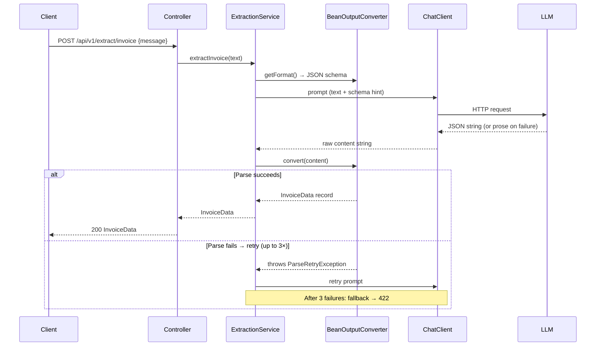

# Module 03 — Structured Output

> **Prerequisite**: [Module 02 — Prompt Engineering](../02-prompt-engineering/README.md)

## Learning Objectives

- Use `BeanOutputConverter` to make the LLM return typed Java records instead of free-form text.
- Understand how Jackson annotations (`@JsonPropertyDescription`, `@JsonClassDescription`) generate the JSON schema that guides the LLM.
- Handle parse failures gracefully with Resilience4j retry — the LLM occasionally returns prose instead of JSON.
- Know when to use `.call().entity(MyRecord.class)` vs `.call().content()` + manual parsing.
- See the LangChain4j equivalent: typed return types on `AiService` interfaces.

## Prerequisites

- [Module 02](../02-prompt-engineering/README.md) completed
- `docker compose up -d` running at repo root

## Architecture



## Key Concepts

### BeanOutputConverter
`BeanOutputConverter<T>` inspects the target class's Jackson annotations and generates a JSON schema. It appends that schema to the prompt via `converter.getFormat()`:

```java
var converter = new BeanOutputConverter<>(InvoiceData.class);

// getFormat() returns something like:
// "Your response must be a JSON object matching this schema: { ... }"

String response = chatClient.prompt()
    .user(u -> u.text("Extract invoice data.\n{format}\n\nText: {text}")
        .param("format", converter.getFormat())
        .param("text", rawText))
    .call()
    .content();

InvoiceData result = converter.convert(response);
```

The shorthand is `.call().entity(InvoiceData.class)` — which wires both steps internally. Use `getFormat()` manually when you need control over where the schema hint appears in the prompt.

### Temperature = 0 for extraction
Structured extraction is not a creative task. Setting `temperature: 0.0` in `application.yml` makes the LLM deterministic — the same input produces the same output — which makes tests reliable and reduces hallucination.

### Jackson annotations drive the schema
Every `@JsonPropertyDescription` becomes a field description in the generated JSON schema. The LLM reads these to know what to extract and what format to use. Missing annotations → missing schema hints → LLM guesses → wrong output.

```java
@JsonPropertyDescription("Invoice date in ISO-8601 format (YYYY-MM-DD)")
String invoiceDate,
```

### Parse-failure retry with Resilience4j
The LLM sometimes returns markdown-fenced JSON (` ```json ... ``` `), partial JSON, or prose. `BeanOutputConverter` strips markdown fences automatically. For other failures, `ParseRetryException` is thrown and Resilience4j retries the full LLM call up to `max-attempts: 3`. If all retries fail, the `fallbackMethod` throws `ExtractionFailedException` → the `ExtractionExceptionHandler` returns a `422` with a stable `errorCode: EXTRACTION_PARSE_FAILURE`.

### LangChain4j typed AiService
LangChain4j supports structured output at the interface level — return type is a record, no converter wiring required:

```java
public interface DocumentExtractionService {
    @SystemMessage("Extract data as JSON matching the schema.")
    @UserMessage("Extract invoice data from:\n\n{{text}}")
    InvoiceData extractInvoice(@V("text") String text);
}
```

`AiServices.builder(DocumentExtractionService.class).chatLanguageModel(model).build()` generates the implementation. The schema is derived from the record's Jackson annotations — same mechanism, cleaner API.

## How to Run

```bash
docker compose up -d
./mvnw -pl 03-structured-output spring-boot:run

# With OpenAI (deterministic, more reliable structured output)
OPENAI_API_KEY=sk-... ./mvnw -pl 03-structured-output spring-boot:run -Pcloud
```

### Example requests

```bash
TOKEN="<your-jwt>"

# Extract invoice
curl -X POST http://localhost:8080/api/v1/extract/invoice \
  -H "Authorization: Bearer $TOKEN" \
  -H "Content-Type: application/json" \
  -d '{
    "message": "Invoice #INV-2024-042 from TechSupplies Ltd, dated March 15 2024. Items: 5x USB-C Hub at $29.99 each, 2x Mechanical Keyboard at $149.99 each. Total: $449.93. Currency: USD."
  }'

# Analyze review
curl -X POST http://localhost:8080/api/v1/extract/review \
  -H "Authorization: Bearer $TOKEN" \
  -H "Content-Type: application/json" \
  -d '{
    "message": "The laptop arrived on time but the keyboard feels mushy and the battery life is terrible. Display is gorgeous though. Would not buy again."
  }'

# Extract resume
curl -X POST http://localhost:8080/api/v1/extract/resume \
  -H "Authorization: Bearer $TOKEN" \
  -H "Content-Type: application/json" \
  -d '{"message": "Jane Smith, jane@example.com. Senior Software Engineer at Acme Corp (2019-present). Skills: Java, Spring Boot, Kubernetes, PostgreSQL. BS Computer Science, MIT 2016."}'
```

## Code Walkthrough

| File | Purpose |
|---|---|
| `domain/InvoiceData.java` | Record with `@JsonPropertyDescription` annotations — teaches schema design |
| `domain/ProductReview.java` | Record with an enum field — shows enum handling in structured output |
| `domain/ResumeData.java` | Nested records — shows complex schema generation |
| `exception/ParseRetryException.java` | Marker exception; Resilience4j retries on this type specifically |
| `ExtractionService.java` | `BeanOutputConverter` usage, `@Retry` with fallback, `parseOrThrow` helper |
| `ExtractionController.java` | REST layer with typed response bodies and OpenAPI schema references |
| `ExtractionExceptionHandler.java` | Maps `ExtractionFailedException` → `422 ProblemDetail` with stable `errorCode` |
| `langchain4j/DocumentExtractionService.java` | Typed record return types on an AiService interface |
| `BeanOutputConverterTest.java` | Schema generation tests — no LLM, runs in any CI |
| `ExtractionControllerTest.java` | Controller tests: happy path, 422 on extraction failure, 401, 400 |

## Common Pitfalls

- **Missing `@JsonPropertyDescription`**: the LLM receives a schema with no field descriptions and fills in random values. Every field that matters must have a description.
- **Nullable optional fields**: if a field is `String currency` (non-null in Java), the LLM will invent a currency rather than omit the field. Declare optional fields as nullable in the record (records allow null values) and document them as `"Null if not stated"` in the description.
- **Enum fields**: the LLM must see the valid enum values in the schema or it will return strings like `"positive"` (lowercase) that fail deserialization. `BeanOutputConverter` includes enum values automatically — verify with `BeanOutputConverterTest`.
- **Nested records**: `BeanOutputConverter` handles nested records recursively. If a nested type is not a record but a plain class, add a no-args constructor or Jackson will fail at parse time.
- **High temperature for extraction**: any temperature above `0.2` introduces randomness that makes extraction non-deterministic. Set `temperature: 0.0` for all extraction endpoints.
- **`entity()` vs `content()` + `convert()`**: `.call().entity(InvoiceData.class)` is equivalent but hides the schema injection. Use `getFormat()` manually when you need to control exactly where the schema hint appears in the prompt (e.g., at the end, not the middle).

## Further Reading

- [Spring AI Structured Output docs](https://docs.spring.io/spring-ai/reference/api/structured-output-converter.html)
- [LangChain4j structured outputs](https://docs.langchain4j.dev/tutorials/structured-outputs)
- [Resilience4j retry](https://resilience4j.readme.io/docs/retry)
- [JSON Schema specification](https://json-schema.org/learn/getting-started-step-by-step)

## What's Next

[Module 04 — Tool Calling](../04-tool-calling/README.md): let the LLM decide which tools to invoke, in which order, using the ReAct pattern.
