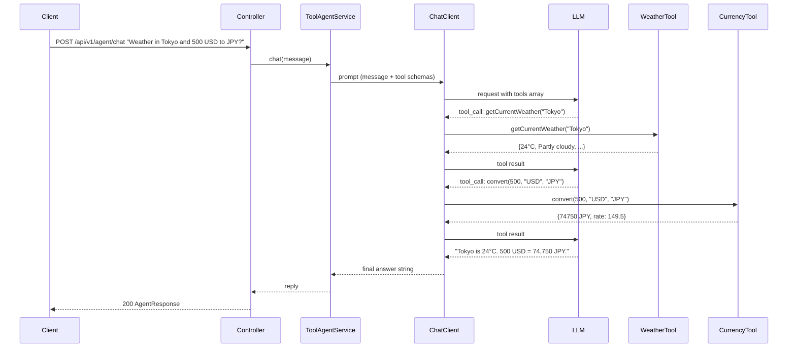

# Module 04 — Tool Calling

> **Prerequisite**: [Module 03 — Structured Output](../03-structured-output/README.md)

## Learning Objectives

- Understand the ReAct (Reason + Act) pattern: the LLM decides *which* tool to call, calls it, observes the result, then either calls another tool or produces a final answer.
- Write `@Tool` descriptions that help the LLM make correct routing decisions.
- Register tools with `ChatClient` via `.defaultTools()` and observe invocations with `SimpleLoggerAdvisor`.
- Protect external API calls with Resilience4j `@CircuitBreaker` and `@Bulkhead`.
- Know the LangChain4j equivalent (`dev.langchain4j.agent.tool.@Tool` + `AiServices.builder().tools(...)`).

## Prerequisites

- [Module 03](../03-structured-output/README.md) completed
- `docker compose up -d` running

## Architecture



## Key Concepts

### @Tool description is a prompt, not a comment
The LLM reads the `description` field to decide *when* to call a tool. A vague description produces random tool selection. A good description answers:
- *When* should I call this tool? ("Use this when the user asks about weather...")
- *What* are the inputs? ("city name as a string, e.g. 'London'")
- *What* does it return? ("temperature in Celsius, humidity, wind speed")

```java
@Tool(description = """
        Get the current weather conditions for a specific city.
        Use this tool when the user asks about the weather, temperature,
        conditions, or forecast for a location.
        Input: city name as a string (e.g. "London", "Tokyo").
        Returns: temperature in Celsius, weather description, humidity, wind speed.
        """)
public WeatherResult getCurrentWeather(String city) { ... }
```

### Registering tools with ChatClient
Tools are registered on the `ChatClient` builder. Spring AI inspects all `@Tool`-annotated methods and generates a JSON tool schema for each, which is included in every LLM request.

```java
chatClientBuilder
    .defaultTools(weatherTool, calculatorTool, stockPriceTool, currencyTool)
    .defaultAdvisors(new SimpleLoggerAdvisor())   // logs tool calls at DEBUG
    .build();
```

### SimpleLoggerAdvisor — see what's happening
With `org.springframework.ai=DEBUG` in logging config, `SimpleLoggerAdvisor` prints every tool call and result:
```
[TOOL CALL]   getCurrentWeather("Tokyo")
[TOOL RESULT] getCurrentWeather → WeatherResult{city='Tokyo', temperatureCelsius=24, ...}
```
Replace with a custom `ObservationAdvisor` in module 08 for production-grade tracing.

### ReAct loop
The LLM may call multiple tools in sequence. The `ChatClient` automatically handles this loop:
1. LLM decides to call `getCurrentWeather("Tokyo")` → executes it → feeds result back to LLM.
2. LLM decides to call `convert(500, "USD", "JPY")` → executes it → feeds result back.
3. LLM has enough information → produces final natural-language answer.

The loop terminates when the LLM returns a final text response (no more `tool_call` blocks).

### Circuit breaker on external tools
Every tool that calls an external API is annotated with `@CircuitBreaker` and `@Bulkhead`. If the external service fails:
- Circuit breaker opens after 50% failure rate over 10 calls.
- Fallback method returns a graceful message the LLM can include in its response.
- Bulkhead limits concurrent calls to prevent a slow external API from exhausting threads.

```java
@CircuitBreaker(name = "externalApiCircuitBreaker", fallbackMethod = "weatherFallback")
@Bulkhead(name = "externalApiBulkhead", type = Bulkhead.Type.SEMAPHORE)
public WeatherResult getCurrentWeather(String city) { ... }
```

### What tools must NOT do
- Execute dynamic expressions (`eval`, `ScriptEngine`) — LLM can craft inputs to run arbitrary code.
- Execute raw SQL from LLM input — parameterise all queries.
- Call other tools directly — tool → tool calls bypass the LLM's reasoning loop.
- Contain business logic — tools call services; services contain logic.

### LangChain4j comparison
LangChain4j uses `dev.langchain4j.agent.tool.@Tool` (different package), registered via `AiServices.builder().tools(instance)`. The concept is identical — the framework generates the tool schema and manages the ReAct loop. LangChain4j shines when you want a purely interface-driven API (`ToolAssistant.answer(question)`) with no service class wiring.

## How to Run

```bash
docker compose up -d
./mvnw -pl 04-tool-calling spring-boot:run
# Watch the DEBUG logs to see tool calls in real time
```

### Example requests

```bash
TOKEN="<your-jwt>"

# Single tool call
curl -X POST http://localhost:8080/api/v1/agent/chat \
  -H "Authorization: Bearer $TOKEN" \
  -H "Content-Type: application/json" \
  -d '{"message": "What is the current stock price of NVIDIA?"}'

# Multi-tool call (watch logs for 2 tool invocations)
curl -X POST http://localhost:8080/api/v1/agent/chat \
  -H "Authorization: Bearer $TOKEN" \
  -H "Content-Type: application/json" \
  -d '{"message": "What is the weather in London? And how much is 1000 GBP in JPY?"}'

# Calculator
curl -X POST http://localhost:8080/api/v1/agent/chat \
  -H "Authorization: Bearer $TOKEN" \
  -H "Content-Type: application/json" \
  -d '{"message": "If I have 3 servers each costing $450/month, what is my annual infrastructure cost?"}'
```

## Code Walkthrough

| File | Purpose |
|---|---|
| `tool/WeatherTool.java` | `@Tool` with LLM-readable description, `@CircuitBreaker`, `@Bulkhead`, fallback |
| `tool/CalculatorTool.java` | Side-effect-free tool — no circuit breaker needed; shows safe arithmetic |
| `tool/StockPriceTool.java` | Stubbed market data; demonstrates circuit breaker + bulkhead pattern |
| `tool/CurrencyTool.java` | Multi-step tool (rate table lookup + arithmetic) with fallback |
| `ToolAgentService.java` | `ChatClient` with `.defaultTools()` + `SimpleLoggerAdvisor`; `@Retry` + fallback |
| `ToolAgentController.java` | Single `/chat` endpoint; OpenAPI description shows compound query example |
| `langchain4j/Lc4jToolAgent.java` | LangChain4j `@Tool` + typed `AiService` + `AiServices.builder().tools(...)` |
| `ToolAnnotationTest.java` | Asserts every `@Tool` description is ≥50 chars — enforces LLM-quality descriptions |
| `CalculatorToolTest.java` | Parameterised unit tests; catches arithmetic edge cases at build time |

## Common Pitfalls

- **Vague `@Tool` description**: if the description says `"Gets weather"`, the LLM won't know when to use it vs asking the user. Descriptions must explain *when*, *what input*, and *what output*.
- **Tool calls other tools**: the LLM's reasoning loop depends on observing each tool result before deciding the next action. Chaining tools directly inside a tool bypasses this and produces unpredictable reasoning.
- **No circuit breaker on external calls**: a slow weather API will block threads. Every network call in a tool needs a bulkhead. Check Resilience4j metrics at `/actuator/metrics/resilience4j.circuitbreaker.state`.
- **Multi-turn tool loops are expensive**: a compound query ("weather + currency + stock") may require 3+ LLM round trips. Each round trip costs tokens. Set `org.springframework.ai=DEBUG` to count how many turns a query actually takes.
- **Model capability matters**: smaller local models (llama3.1:8b) sometimes ignore tools entirely on complex queries. Use a 70B model locally or a cloud model for reliable multi-tool chaining.

## Further Reading

- [Spring AI Tool Calling](https://docs.spring.io/spring-ai/reference/api/tool-calling.html)
- [LangChain4j Tools/Agents](https://docs.langchain4j.dev/tutorials/tools)
- [ReAct: Synergizing Reasoning and Acting in Language Models](https://arxiv.org/abs/2210.03629)
- [Resilience4j Circuit Breaker](https://resilience4j.readme.io/docs/circuitbreaker)

## What's Next

[Module 05 — RAG Basics](../05-rag-basics/README.md): load documents, embed them into PGVector, and augment LLM responses with retrieved context using `QuestionAnswerAdvisor`.
