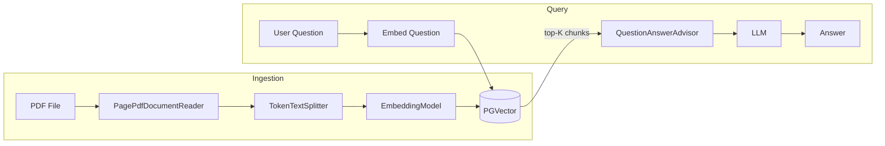

# Module 05 — RAG Basics

> **Prerequisite**: [Module 04 — Tool Calling](../04-tool-calling/README.md). Requires PGVector running (`docker compose up -d`).

## Learning Objectives
- Build an ingestion pipeline: PDF → chunk → embed → PGVector.
- Use `QuestionAnswerAdvisor` to automatically retrieve and inject context before every LLM call.
- Understand chunking strategy trade-offs (`chunkSize`, `chunkOverlap`).
- Restrict ingestion to ADMIN users; reads are open to all authenticated users.
- Know the LangChain4j equivalent: `EmbeddingStoreIngestor` + `ContentRetriever`.

## Architecture



## Key Concepts

### QuestionAnswerAdvisor
Registered on `ChatClient.Builder.defaultAdvisors()`. It intercepts every user message, embeds it, searches PGVector for the top-K semantically similar chunks, appends them to the prompt as `[CONTEXT]`, then forwards the augmented prompt to the LLM. The LLM is instructed to answer only from context.

### Chunking strategy
`TokenTextSplitter(chunkSize=800, chunkOverlap=100)` splits documents into 800-token chunks with 100-token overlap. Overlap prevents information loss at chunk boundaries. Configurable via `app.rag.*` in `application.yml`.

### Embedding model alignment
The **same** embedding model must be used for ingestion and retrieval. Mixing models produces meaningless similarity scores. The profile-specific `application-*.yml` sets the right model dimension (`1536` for OpenAI, `768` for nomic-embed-text).

## How to Run

```bash
docker compose up -d   # starts PGVector
./mvnw -pl 05-rag-basics spring-boot:run

# Ingest a document (needs ADMIN JWT)
curl -X POST http://localhost:8080/api/v1/rag/ingest/text \
  -H "Authorization: Bearer $ADMIN_TOKEN" \
  -H "Content-Type: application/json" \
  -d '{"message": "Spring AI is a framework that abstracts over multiple LLM providers including OpenAI, Anthropic, Ollama and more."}' \
  '?source=spring-ai-docs'

# Ask a question
curl -X POST http://localhost:8080/api/v1/rag/ask \
  -H "Authorization: Bearer $TOKEN" \
  -H "Content-Type: application/json" \
  -d '{"message": "What LLM providers does Spring AI support?"}'
```

## Common Pitfalls
- **Embedding dimension mismatch**: changing models after initial schema creation causes PGVector index errors. Drop and recreate the `vector_store` table when switching models.
- **`initialize-schema: true`**: creates the table on startup — safe for dev, disable in production and manage schema via Flyway/Liquibase.
- **Empty corpus**: `QuestionAnswerAdvisor` returns an empty context if nothing is ingested. The LLM will answer "I don't have enough information" — which is correct behaviour, not a bug.
- **Similarity threshold too high**: setting `similarityThreshold: 0.9` will return zero results for most questions. Start at `0.7` and tune from eval metrics in module 12.

## What's Next
[Module 06 — Memory and Context](../06-memory-and-context/README.md)
