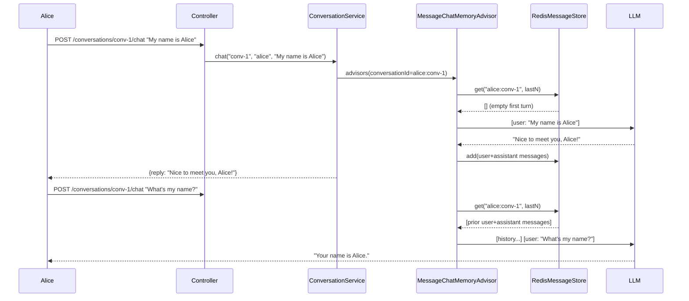

# Module 06 — Memory and Context

> **Prerequisite**: [Module 05 — RAG Basics](../05-rag-basics/README.md). Requires Redis (`docker compose up -d`).

## Learning Objectives
- Use `MessageChatMemoryAdvisor` to inject conversation history before every LLM call.
- Implement `ChatMemory` with Redis for persistence across restarts and horizontal scaling.
- Apply a sliding window to prevent unbounded token growth.
- Scope memory per user so conversations are isolated.

## Architecture



## Key Concepts

### User-scoped conversation ID
The conversation key in Redis is `userId:conversationId`. This ensures user A cannot access user B's conversation history, even if they use the same `conversationId` string.

### Sliding window
`RedisMessageStore` keeps only the last `app.memory.max-messages` messages. Older messages are dropped silently. This caps token usage at approximately `maxMessages × avgTokensPerMessage`.

### Why not InMemoryChatMemory in production
`InMemoryChatMemory` lives in the JVM heap. It is reset on every restart and is not shared between instances. Any load balancer distributing requests across two instances will lose context on the second request. Redis solves both problems.

## How to Run

```bash
docker compose up -d   # starts Redis
./mvnw -pl 06-memory-and-context spring-boot:run

TOKEN="<your-jwt>"
# Step 1: get a conversation ID
CONV=$(curl -s -X POST http://localhost:8080/api/v1/conversations/new \
  -H "Authorization: Bearer $TOKEN" | jq -r .conversationId)

# Step 2: multi-turn
curl -X POST "http://localhost:8080/api/v1/conversations/$CONV/chat" \
  -H "Authorization: Bearer $TOKEN" -H "Content-Type: application/json" \
  -d '{"message":"My name is Alice and I work in finance."}'

curl -X POST "http://localhost:8080/api/v1/conversations/$CONV/chat" \
  -H "Authorization: Bearer $TOKEN" -H "Content-Type: application/json" \
  -d '{"message":"What industry do I work in?"}'
# → LLM replies "You work in finance."
```

## Common Pitfalls
- **Forgetting to scope by user**: using only `conversationId` as the Redis key lets any authenticated user read any conversation by guessing the ID.
- **No TTL on Redis keys**: without `ttlMinutes`, conversation keys accumulate forever. Set a sensible TTL (60 min for chat, 24h for long-running tasks).
- **Token explosion**: a 20-message sliding window with long messages can still exceed context limits on smaller models. Monitor token usage in module 08.

## What's Next
[Module 07 — API Management](../07-api-management/README.md)
