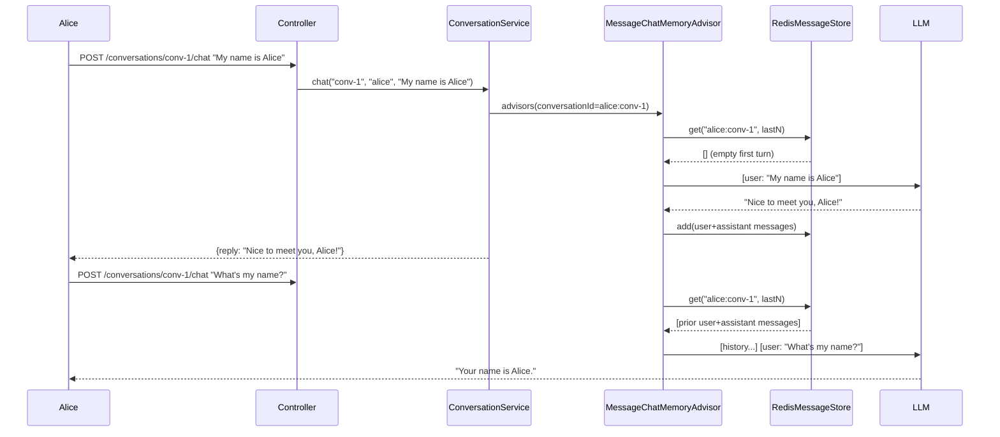

# Module 06 — Memory and Context

> **Prerequisite**: [Module 05 — RAG Basics](../05-rag-basics/README.md)

## Learning Objectives
- Use `MessageChatMemoryAdvisor` to inject conversation history before every LLM call.
- Implement `ChatMemory` with Redis for persistence across restarts and horizontal scaling.
- Apply a sliding window to prevent unbounded token growth.
- Scope memory per user so conversations are isolated.
- Compare memory strategies: no memory, full history, sliding window, and summarization.

## Prerequisites

- [Module 05](../05-rag-basics/README.md) completed
- `docker compose up -d` running at repo root (starts Redis on port 6379)
- A valid JWT token — generate one from Module 01's `/api/v1/auth/token` endpoint
- `jq` installed (optional, for parsing the `conversationId` from JSON responses)

## Architecture



## Key Concepts

### User-scoped conversation ID
The conversation key in Redis is `userId:conversationId`. This ensures user A cannot access user B's conversation history, even if they use the same `conversationId` string.

### Sliding window
`RedisMessageStore` keeps only the last `app.memory.max-messages` messages. Older messages are dropped silently. This caps token usage at approximately `maxMessages × avgTokensPerMessage`.

### Why not InMemoryChatMemory in production
`InMemoryChatMemory` lives in the JVM heap. It is reset on every restart and is not shared between instances. Any load balancer distributing requests across two instances will lose context on the second request. Redis solves both problems.

### Summarizing memory (advanced)
`SummarizingMemoryService` demonstrates a fourth strategy: when history exceeds a threshold, the oldest half is summarized by the LLM into a compact bullet-point note that replaces those messages. This preserves key facts (user's name, goals, preferences) even after the sliding window would have discarded them. See `SummarizingMemoryService.java` for the implementation.

| Strategy | Token cost | Context retention | Implementation |
|---|---|---|---|
| No memory | Lowest | None | No advisor |
| Full history | Grows unbounded | Perfect | `InMemoryChatMemory` |
| Sliding window | Fixed | Recent only | `RedisMessageStore` (this module) |
| Summarizing | Grows slowly | Gist of everything | `SummarizingMemoryService` (this module) |

## How to Run

```bash
docker compose up -d   # starts Redis
./mvnw -pl 06-memory-and-context spring-boot:run

TOKEN="<your-jwt>"
# Step 1: get a conversation ID
CONV=$(curl -s -X POST http://localhost:8080/api/v1/conversations/new \
  -H "Authorization: Bearer $TOKEN" | jq -r .conversationId)

# Step 2: multi-turn
curl -X POST "http://localhost:8080/api/v1/conversations/$CONV/chat" \
  -H "Authorization: Bearer $TOKEN" -H "Content-Type: application/json" \
  -d '{"message":"My name is Alice and I work in finance."}'

curl -X POST "http://localhost:8080/api/v1/conversations/$CONV/chat" \
  -H "Authorization: Bearer $TOKEN" -H "Content-Type: application/json" \
  -d '{"message":"What industry do I work in?"}'
# → LLM replies "You work in finance."

# Clear conversation history
curl -X DELETE "http://localhost:8080/api/v1/conversations/$CONV" \
  -H "Authorization: Bearer $TOKEN"
# → 204 No Content
```

## Code Walkthrough

| File | Purpose |
|---|---|
| `RedisMessageStore.java` | `ChatMemory` implementation backed by Redis. Applies sliding window (keeps last `maxMessages`) and TTL-based eviction. |
| `ConversationService.java` | Wires `MessageChatMemoryAdvisor` into `ChatClient`. Scopes each conversation to a user with `userId:conversationId` key. Records token usage via `TokenUsageMetrics`. |
| `SummarizingMemoryService.java` | Alternative memory strategy: LLM-generated summaries replace old messages instead of discarding them. Demonstrates the trade-off between token cost and context retention. |
| `ConversationController.java` | REST layer: `POST /new`, `POST /{id}/chat`, `DELETE /{id}`. Extracts the authenticated username from Spring Security context. |
| `MemoryExceptionHandler.java` | Maps `IllegalArgumentException` (input validation failure) to `400 Bad Request` with a `ProblemDetail` body. |
| `MemoryProperties.java` | `@ConfigurationProperties` record — externalises `maxMessages` and `ttlMinutes` to `application.yml`. |
| `ConversationControllerTest.java` | Controller-layer tests: happy path, 401 for missing JWT, 400 for blank input, 204 for delete. |
| `ConversationServiceTest.java` | Service-layer tests with mocked `ChatClient.Builder`. |
| `RedisMessageStoreTest.java` | Unit tests for sliding window and TTL behaviour (no Redis required — mocks `StringRedisTemplate`). |

## Common Pitfalls
- **Forgetting to scope by user**: using only `conversationId` as the Redis key lets any authenticated user read any conversation by guessing the ID.
- **No TTL on Redis keys**: without `ttlMinutes`, conversation keys accumulate forever. Set a sensible TTL (60 min for chat, 24h for long-running tasks).
- **Token explosion**: a 20-message sliding window with long messages can still exceed context limits on smaller models. Monitor token usage in module 08.

## Further Reading

- [Spring AI Chat Memory docs](https://docs.spring.io/spring-ai/reference/api/chatclient.html#_chat_memory)
- [MessageChatMemoryAdvisor Javadoc](https://docs.spring.io/spring-ai/reference/api/advisors.html)
- [Redis data structures — Strings vs Lists for message storage](https://redis.io/docs/data-types/strings/)
- [LangChain4j Memory types](https://docs.langchain4j.dev/tutorials/chat-memory) — compare approaches
- [Token budgeting strategies (OpenAI cookbook)](https://cookbook.openai.com/examples/how_to_count_tokens_with_tiktoken)

## What's Next
[Module 07 — API Management](../07-api-management/README.md) — deep-dive on JWT, per-user API keys, Redis-backed rate limiting, and cost tracking that's been silently active since Module 01.
