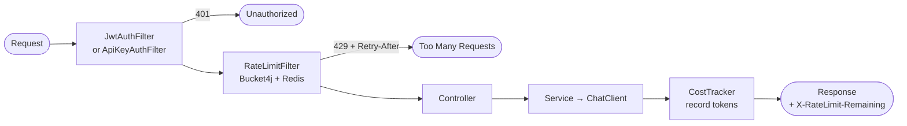

# Module 07 — API Management

> **Prerequisite**: [Module 06 — Memory and Context](../06-memory-and-context/README.md)

This is the flagship module. Every concern here is already wired into earlier modules from `shared/` — this module explains them in depth and adds cost tracking and usage dashboards.

## Learning Objectives
- Understand the full JWT + API key authentication pipeline.
- See why Bucket4j rate limit state must be in Redis for multi-instance deployments.
- Implement per-user token usage tracking with cost estimation.
- Expose usage data via `/me/usage` and `/me/usage/history` endpoints.
- Know the API versioning contract: never break a versioned endpoint.

## Architecture — Filter Chain



## Key Concepts

### JWT Authentication
`JwtAuthFilter` (in `shared/`) validates the `Authorization: Bearer <token>` header on every request. The token is signed with HS256 using the `app.security.jwt.secret`. Stateless — no session storage.

### Rate Limiting — why Redis
The Phase 1 `RateLimitFilter` in `shared/` uses an in-process `ConcurrentHashMap`. This means two app instances have separate rate limit state — a user could exceed their quota by 2× under a load balancer. **Module 07 upgrade**: replace the map with `bucket4j-redis` so all instances share one bucket per user.

### Cost Tracking
Every LLM call records `promptTokens + completionTokens + estimatedCostUsd` to `usage_records`. Use `GET /api/v1/me/usage` to view your total. Grafana dashboards (module 08) will visualise cost per user over time.

### API Versioning
All endpoints use `/api/v1/...`. When a breaking change is needed, add `/api/v2/...` and keep v1 working for at least one deprecation cycle. Never change the response schema of a published versioned endpoint.

### OpenAPI Security Scheme
`OpenApiConfig` in `shared/` registers a `bearerAuth` security scheme. Every `@SecurityRequirement(name = "bearerAuth")` on a controller class/method makes that endpoint show a padlock in the Swagger UI with a "Try it out" flow that sends the Bearer token.

## How to Run

```bash
docker compose up -d
./mvnw -pl 07-api-management spring-boot:run

# Get a token
TOKEN=$(curl -s -X POST http://localhost:8080/api/v1/auth/token \
  -H "Content-Type: application/json" \
  -d '{"username":"demo","password":"demo"}' | jq -r .token)

# Chat (records usage)
curl -X POST http://localhost:8080/api/v1/agent/chat \
  -H "Authorization: Bearer $TOKEN" -H "Content-Type: application/json" \
  -d '{"message":"Explain JWT in one sentence"}'

# View usage
curl http://localhost:8080/api/v1/me/usage -H "Authorization: Bearer $TOKEN"
curl http://localhost:8080/api/v1/me/usage/history -H "Authorization: Bearer $TOKEN"

# Over-quota test (run in a loop to hit 429)
for i in {1..25}; do
  curl -s -o /dev/null -w "%{http_code}\n" -X POST http://localhost:8080/api/v1/agent/chat \
    -H "Authorization: Bearer $TOKEN" -H "Content-Type: application/json" \
    -d '{"message":"hi"}'
done
```

## Common Pitfalls
- **JWT secret shorter than 32 bytes**: JJWT will throw `WeakKeyException`. The default in `application.yml` is exactly 32+ chars for local dev.
- **Rate limit state in JVM heap at scale**: the in-process `ConcurrentHashMap` in Phase 1 works for single-instance demos. Upgrade to `bucket4j-redis` before deploying multiple instances.
- **Token cost estimation**: `estimateTokens(text.length() / 4)` is a rough approximation. Wire `ChatResponse.getMetadata().getUsage()` for exact counts from the API response in production.

## What's Next
[Module 08 — Observability](../08-observability/README.md)
