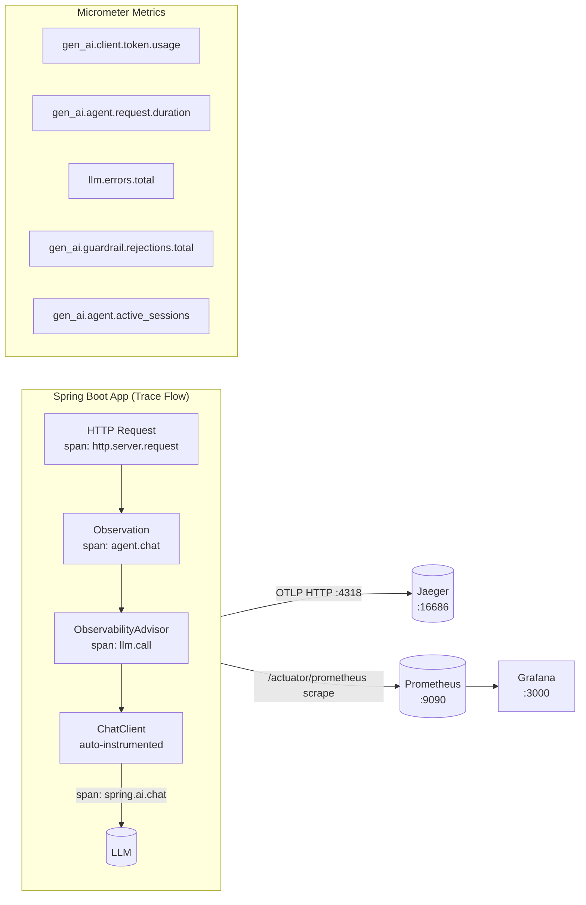

# Module 08 — Observability

> **Prerequisite**: [Module 07 — API Management](../07-api-management/README.md). Requires Jaeger + Prometheus + Grafana (`docker compose up -d`).

## Learning Objectives
- Understand how Spring AI 1.0 auto-instruments `ChatClient` calls with Micrometer Observations.
- Create custom spans with `ObservationRegistry` to trace agent-level logic (nested under the HTTP span).
- Build a **custom `CallAroundAdvisor`** to intercept every LLM call for metrics and tracing.
- Export traces to Jaeger via OTLP and verify end-to-end: HTTP → agent span → LLM span.
- Export metrics to Prometheus and import a **production Grafana dashboard** with token usage, latency histograms, and error rates.
- Know the OpenTelemetry semantic conventions for generative AI (`gen_ai.*` metrics).

## Architecture



### Trace Hierarchy in Jaeger
```
HTTP POST /api/v1/observe/chat                          (auto — Spring MVC)
└── agent.chat [user.id=alice]                          (AgentObservationService)
    └── llm.call [status=success]                       (ObservabilityAdvisor)
        └── spring.ai.chat [model=gpt-4o-mini]         (Spring AI auto)
```

## Key Concepts

### Spring AI auto-instrumentation
Spring AI 1.0 instruments `ChatClient` calls automatically when `micrometer-tracing-bridge-otel` is on the classpath. Each call emits:
- **Span** `spring.ai.chat` with attributes: `gen_ai.system`, `gen_ai.request.model`, `gen_ai.usage.prompt_tokens`, `gen_ai.usage.completion_tokens`
- **Metric** `gen_ai.client.token.usage` (counter, tagged by model)
- **Metric** `gen_ai.client.operation.duration` (timer)

### Spring AI auto-instrumentation
Spring AI 1.0 instruments `ChatClient` calls automatically when `micrometer-tracing-bridge-otel` is on the classpath. Each call emits:
- **Span** `spring.ai.chat` with attributes: `gen_ai.system`, `gen_ai.request.model`, `gen_ai.usage.prompt_tokens`, `gen_ai.usage.completion_tokens`
- **Metric** `gen_ai.client.token.usage` (counter, tagged by model and token_type)
- **Metric** `gen_ai.client.operation.duration` (timer)

### Custom spans with ObservationRegistry
Wrap business logic in `Observation.createNotStarted("name", registry).observe(() -> ...)` to add a custom span that appears as a child of the HTTP request span in Jaeger. Keep `lowCardinalityKeyValue` attributes bounded — never add user messages or model responses as attributes (unbounded cardinality breaks Prometheus).

### Spring AI Advisors for cross-cutting concerns
`CallAroundAdvisor` intercepts every `ChatClient.call()` — like a servlet filter for LLM calls. The `ObservabilityAdvisor` in this module:
1. Creates an `llm.call` span that wraps the Spring AI span
2. Increments `llm.calls.total` and `llm.errors.total` counters
3. Captures the error type on failures

```java
// Register advisor on the ChatClient — runs for every call
this.chatClient = builder
    .defaultAdvisors(observabilityAdvisor, new SimpleLoggerAdvisor())
    .build();
```

Advisor order matters: `getOrder()` returning `Integer.MIN_VALUE` makes it the outermost wrapper.

### Prometheus + Grafana dashboards
Import `src/main/resources/grafana/ai-agents-dashboard.json` into Grafana (`http://localhost:3000` → Dashboards → Import). The dashboard includes:
- Token usage rate (input vs output tokens/min)
- P50/P95 agent request latency histogram
- Guardrail rejection rate (spike = someone probing your endpoint)
- Active sessions gauge
- LLM error rate timeline

### OTel semantic conventions for Gen AI
Follow the [OpenTelemetry GenAI spec](https://opentelemetry.io/docs/specs/semconv/gen-ai/) for metric and span attribute naming. Key conventions:
| Attribute | Value example | Where |
|-----------|--------------|-------|
| `gen_ai.system` | `openai`, `ollama` | span |
| `gen_ai.request.model` | `gpt-4o-mini` | span |
| `gen_ai.usage.prompt_tokens` | `127` | span |
| `gen_ai.usage.completion_tokens` | `89` | span |
| `token_type` label | `input`, `output` | Prometheus metric |

## How to Run

```bash
docker compose up -d   # starts Jaeger, Prometheus, Grafana
./mvnw -pl 08-observability spring-boot:run

# Send some traffic
for i in {1..10}; do
  curl -s -X POST http://localhost:8080/api/v1/observe/chat \
    -H "Authorization: Bearer $TOKEN" -H "Content-Type: application/json" \
    -d "{\"message\":\"Question $i: what is observability?\"}" > /dev/null
done

# View traces
open http://localhost:16686   # Jaeger UI → Search → Service: observability

# View metrics
open http://localhost:9090    # Prometheus → Graph → gen_ai_client_token_usage_total
open http://localhost:3000    # Grafana → Dashboards → Agent Overview
```

## Code Walkthrough

| File | Role |
|------|------|
| `AgentObservationService.java` | Service with nested Observation wrapping the ChatClient call |
| `ObservabilityAdvisor.java` | `CallAroundAdvisor` — intercepts every LLM call; emits span + counters |
| `AgentMetricsDashboard.java` | Registers all `gen_ai.*` Micrometer metrics in one place |
| `ObservabilityController.java` | REST endpoint that passes `userId` down to the service for span tagging |
| `grafana/ai-agents-dashboard.json` | Import this into Grafana to get all panels pre-built |

## Common Pitfalls

- **`sampling.probability: 1.0` in production**: traces every request. Reduce to `0.1` in high-traffic deployments to avoid overwhelming Jaeger and incurring storage costs.
- **Missing OTLP dependency**: without `opentelemetry-exporter-otlp`, spans are collected by Micrometer but never exported. Traces don't appear in Jaeger — add `io.opentelemetry:opentelemetry-exporter-otlp` to your pom.
- **High-cardinality span attributes**: never put user IDs, messages, or free-form text as `lowCardinalityKeyValue`. Prometheus creates a time series per unique label combination — unbounded cardinality causes OOM in Prometheus.
- **Advisor order conflicts**: `ObservabilityAdvisor` must be outermost (lowest `getOrder()`) so its span wraps all other advisors. If `SimpleLoggerAdvisor` runs first, its logs won't be associated with the right span.
- **Grafana no-data**: Prometheus must scrape `/actuator/prometheus`. Verify: `curl localhost:8080/actuator/prometheus | grep gen_ai`.
- **Timer sample lifecycle**: always stop the `Timer.Sample` even on exceptions. Use try/finally or the `Observation.observe()` wrapper to guarantee cleanup.

## Further Reading

- [Spring AI Observability](https://docs.spring.io/spring-ai/reference/observability/index.html)
- [Micrometer Observations](https://micrometer.io/docs/observation)
- [OpenTelemetry GenAI Semantic Conventions](https://opentelemetry.io/docs/specs/semconv/gen-ai/)
- [Grafana Dashboard provisioning](https://grafana.com/docs/grafana/latest/administration/provisioning/)

## What's Next
[Module 09 — Guardrails](../09-guardrails/README.md): add input sanitisation, prompt injection detection, PII redaction, and output content moderation.
