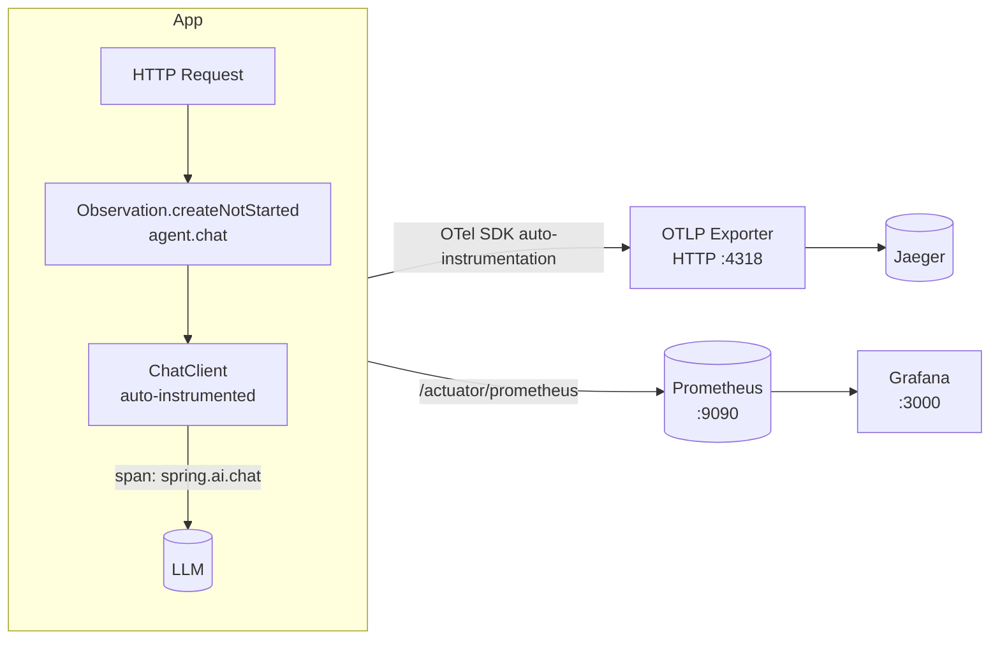

# Module 08 — Observability

> **Prerequisite**: [Module 07 — API Management](../07-api-management/README.md). Requires Jaeger + Prometheus + Grafana (`docker compose up -d`).

## Learning Objectives
- Understand how Spring AI 1.0 auto-instruments `ChatClient` calls with Micrometer Observations.
- Create custom spans with `ObservationRegistry` to trace agent-level logic.
- Export metrics to Prometheus and visualise in Grafana.
- Export traces to Jaeger via OTLP.
- Know the key LLM metrics: `gen_ai.client.token.usage`, `gen_ai.client.operation.duration`.

## Architecture



## Key Concepts

### Spring AI auto-instrumentation
Spring AI 1.0 instruments `ChatClient` calls automatically when `micrometer-tracing-bridge-otel` is on the classpath. Each call emits:
- **Span** `spring.ai.chat` with attributes: `gen_ai.system`, `gen_ai.request.model`, `gen_ai.usage.prompt_tokens`, `gen_ai.usage.completion_tokens`
- **Metric** `gen_ai.client.token.usage` (counter, tagged by model)
- **Metric** `gen_ai.client.operation.duration` (timer)

### Custom spans with ObservationRegistry
Wrap business logic in `Observation.createNotStarted("name", registry).observe(() -> ...)` to add a custom span that appears as a child of the HTTP request span in Jaeger.

### Prometheus + Grafana dashboards
After `docker compose up -d`, Grafana auto-provisions from `config/grafana/provisioning/`. Navigate to `http://localhost:3000` (admin/masterclass) → Dashboards → Agent Overview to see token usage, latency histograms, and error rates.

## How to Run

```bash
docker compose up -d   # starts Jaeger, Prometheus, Grafana
./mvnw -pl 08-observability spring-boot:run

# Send some traffic
for i in {1..10}; do
  curl -s -X POST http://localhost:8080/api/v1/observe/chat \
    -H "Authorization: Bearer $TOKEN" -H "Content-Type: application/json" \
    -d "{\"message\":\"Question $i: what is observability?\"}" > /dev/null
done

# View traces
open http://localhost:16686   # Jaeger UI → Search → Service: observability

# View metrics
open http://localhost:9090    # Prometheus → Graph → gen_ai_client_token_usage_total
open http://localhost:3000    # Grafana → Dashboards → Agent Overview
```

## Common Pitfalls
- **`sampling.probability: 1.0` in production**: traces every request. Reduce to `0.1` (10%) in high-traffic production to avoid overwhelming Jaeger and incurring storage costs.
- **Missing OTLP dependency**: without `opentelemetry-exporter-otlp`, spans are collected by Micrometer but never exported. The app still works — traces just don't appear in Jaeger.
- **Grafana no-data**: Prometheus must successfully scrape `/actuator/prometheus`. Verify with `curl localhost:8080/actuator/prometheus | grep gen_ai`.

## What's Next
[Module 09 — Guardrails](../09-guardrails/README.md)
