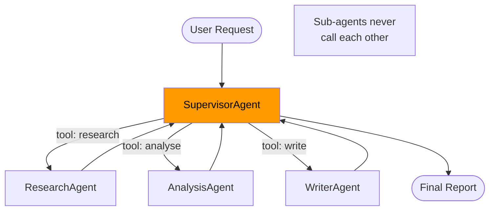

# Module 10 — Multi-Agent Supervisor

> **Prerequisite**: [Module 09 — Guardrails](../09-guardrails/README.md)

## Learning Objectives
- Implement the supervisor pattern: one orchestrator delegates to N specialist sub-agents.
- Register sub-agents as `@Tool` methods on the supervisor's `ChatClient`.
- Enforce the no-peer-calling rule: sub-agents communicate only through the supervisor.
- Attribute cost per sub-agent call using Micrometer counters.

## Architecture



## Key Concepts

### Why the supervisor pattern
A single LLM call struggles with tasks that require distinct expertise (research vs. analysis vs. writing). The supervisor pattern splits the task into specialist agents, each with its own system prompt, and routes the output from one to the next. The supervisor LLM decides the order and what to pass between steps.

### Sub-agents as tools
Each sub-agent is a `@Component` with one `@Tool`-annotated method. The supervisor's `ChatClient` registers all three as tools. The LLM's tool-calling loop handles sequencing:

```
turn 1: supervisor calls research("AI and software engineering")
turn 2: supervisor calls analyse("<research output>")
turn 3: supervisor calls write("<research + analysis>")
turn 4: supervisor returns writer's output as final answer
```

### Cost implications
A single user request triggers **4+ LLM calls** (1 supervisor routing + 3 sub-agents). Monitor with `supervisor.delegations.total` Micrometer counter. Warn users in the UI that multi-agent requests take 3-5× longer and cost more.

### No-peer-calling rule
Sub-agents must not inject each other as dependencies. If `AnalysisAgent` needs to call `ResearchAgent`, the supervisor must be the intermediary. This keeps the reasoning loop visible and prevents unbounded delegation chains.

## How to Run

```bash
./mvnw -pl 10-multi-agent-supervisor spring-boot:run

curl -X POST http://localhost:8080/api/v1/supervisor/process \
  -H "Authorization: Bearer $TOKEN" -H "Content-Type: application/json" \
  -d '{"message": "Write a concise report on the pros and cons of microservices architecture."}'
# Expect 3 LLM calls in the DEBUG logs before the final response
```

## Common Pitfalls
- **Supervisor skipping steps**: smaller models may bypass sub-agents and answer directly. Strengthen the system prompt: "ALWAYS call all three agents in order. Never answer directly."
- **Sub-agent output exceeds context**: if `ResearchAgent` returns 3000 tokens and `AnalysisAgent` returns 2000 tokens, the `WriterAgent` prompt with both inputs may hit context limits. Add a summarisation step or reduce sub-agent verbosity.
- **Cost multiplication**: 3 sub-agents × (prompt + completion tokens) per call. Track this in module 07's `CostTracker`.

## What's Next
[Module 11 — LangChain4j Agentic](../11-langchain4j-agentic/README.md)
