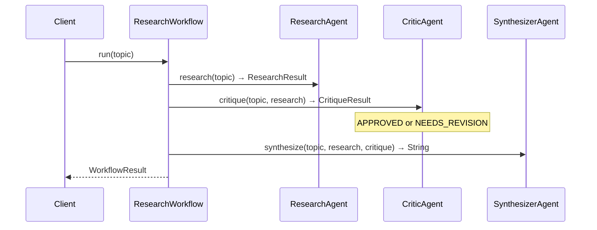

# Module 11 — LangChain4j Agentic

> **Prerequisite**: [Module 10 — Multi-Agent Supervisor](../10-multi-agent-supervisor/README.md)

## Learning Objectives
- Build typed agent interfaces with LangChain4j's `AiServices` — no manual prompt assembly.
- Compose agents into a sequential workflow with a critic loop quality gate.
- Contrast LangChain4j's declarative style with Spring AI's tool-calling approach.
- Understand structured output from `AiServices` using Java records as return types.

## Architecture



## Key Concepts

### Typed AiService interfaces
LangChain4j generates a proxy at runtime for any interface annotated with `@SystemMessage` / `@UserMessage`. The method signature **is** the contract:

```java
public interface ResearchAgent {
    @SystemMessage("You are a rigorous research agent...")
    @UserMessage("Research the following topic: {{topic}}")
    ResearchResult research(@V("topic") String topic);
}
```

Returning a **record** instead of `String` forces the LLM to emit JSON matching the schema, which LangChain4j parses automatically. Spring AI achieves the same via `BeanOutputConverter` but requires explicit converter wiring.

### Sequential workflow with critic loop
`ResearchWorkflow` calls agents in strict order: research → critique → synthesize.
The critic loop is the key architectural difference from a naive pipeline: a second LLM acts as a peer reviewer and can flag issues before the final synthesis. This reduces hallucination-driven errors in the output.

```
Research (LLM call 1)
    ↓
Critique (LLM call 2) → NEEDS_REVISION? → log + proceed with critique in context
    ↓
Synthesize (LLM call 3)
```

### Spring AI vs LangChain4j — when to choose which
| Concern | Spring AI | LangChain4j |
|---|---|---|
| Spring Boot auto-config | Native | Manual bean wiring |
| Typed agent interfaces | No (use `BeanOutputConverter`) | Yes (`AiServices`) |
| Built-in advisors (RAG, memory) | Yes | Manual |
| Agentic workflow DSL | No | Yes (SequentialWorkflow etc.) |
| Tool calling loop | Yes (`@Tool` + `ChatClient`) | Yes (`@Tool` + `AiServices`) |
| Community/ecosystem | Spring ecosystem | Vendor-neutral |

**Rule of thumb**: use Spring AI when you need deep Spring Boot integration (security, actuator, rate limiting). Use LangChain4j when the workflow graph logic is complex or you need the typed interface approach.

### Structured output without extra wiring
`ResearchResult` and `CritiqueResult` are plain Java records. LangChain4j inspects the return type via reflection, generates a JSON schema, appends it to the system prompt, and parses the response — identical to what `BeanOutputConverter` does in Spring AI, but automatic.

## How to Run

```bash
# Local (Ollama)
./mvnw -pl 11-langchain4j-agentic spring-boot:run -Plocal

# Cloud (OpenAI)
export OPENAI_API_KEY=sk-...
./mvnw -pl 11-langchain4j-agentic spring-boot:run -Pcloud

# Get a JWT first (from any running module's /auth/token endpoint)
curl -X POST http://localhost:8080/api/v1/agentic/research \
  -H "Authorization: Bearer $TOKEN" \
  -H "Content-Type: application/json" \
  -d '{"message": "the CAP theorem in distributed systems"}'
# Expect 3 LLM calls; response includes research, critique, and finalReport fields
```

## Code Walkthrough

| File | Purpose |
|---|---|
| `ResearchAgent.java` | Typed interface — research summary, returns `ResearchResult` |
| `CriticAgent.java` | Typed interface — peer review, returns `CritiqueResult` |
| `SynthesizerAgent.java` | Typed interface — final report, returns `String` |
| `ResearchResult.java` | Record: summary, keyFindings, limitations |
| `CritiqueResult.java` | Record with `approved()` helper |
| `AgenticConfig.java` | Wires model bean (profile-selected) + 3 AiService beans |
| `ResearchWorkflow.java` | Orchestrates the 3-step pipeline; emits Micrometer counters |
| `AgenticController.java` | POST `/api/v1/agentic/research` — JWT-secured |

## Common Pitfalls
- **Structured output failures**: if the LLM doesn't emit valid JSON, LangChain4j throws a parse exception. Increase temperature slightly or add `"Respond only with valid JSON"` to the system message.
- **Ollama model size**: smaller models (< 7B params) often fail structured output. Use `llama3.1:8b` or better.
- **Critic always approves**: smaller models are sycophantic and rarely flag issues. For real quality gates, use a stronger model for the critic only.
- **Missing `@V` annotation**: if you forget to annotate a parameter with `@V("name")`, LangChain4j won't substitute the variable and the prompt contains the literal `{{name}}` placeholder.

## Further Reading
- [LangChain4j AiServices docs](https://docs.langchain4j.dev/tutorials/ai-services)
- [LangChain4j structured output](https://docs.langchain4j.dev/tutorials/structured-outputs)
- [Spring AI BeanOutputConverter](https://docs.spring.io/spring-ai/reference/api/structured-output-converter.html)
- [Critic / self-reflection pattern — Reflexion paper](https://arxiv.org/abs/2303.11366)

## What's Next
[Module 12 — Evaluation and Testing](../12-evaluation-and-testing/README.md)
