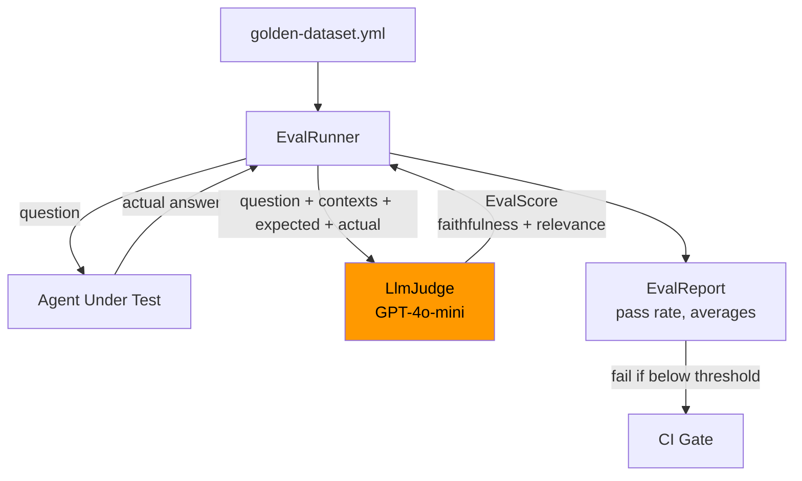

# Module 12 — Evaluation and Testing

> **Prerequisite**: [Module 11 — LangChain4j Agentic](../11-langchain4j-agentic/README.md)

## Learning Objectives
- Understand why unit tests and type checks are insufficient for agent correctness.
- Build a YAML-driven golden dataset for repeatable evaluation runs.
- Implement LLM-as-judge to score faithfulness and relevance automatically.
- Integrate evaluation metrics (pass rate, average scores) into CI pipelines.

## Architecture



## Key Concepts

### Why LLM tests ≠ unit tests
A unit test can verify that your agent *calls* the right tool or *parses* the right JSON schema. It cannot verify that the agent's natural-language *answer* is correct. That judgment requires semantic understanding — which is why we use another LLM as an impartial judge.

### LLM-as-judge (ragas-style)
The judge model receives: the original question, the ideal reference contexts, the expected answer (ground truth), and the agent's actual answer. It returns two scores:

- **Faithfulness** (0–1): is the answer grounded in the reference contexts, or hallucinated?
- **Relevance** (0–1): does the answer actually address the question?

An overall score of `(faithfulness + relevance) / 2` above a configurable threshold (default 0.7) counts as a pass.

### Golden datasets
Store test cases in YAML files under `src/main/resources/eval/`. Each case has:
- `id` — stable identifier (used in regression tracking)
- `question` — what to send to the agent
- `contexts` — the ideal source chunks (from your RAG corpus or documentation)
- `expected_answer` — ground truth the judge compares against

Keep datasets small and curated (10–50 cases) — not exhaustive. Add cases when you find bugs or regressions.

### CI integration pattern
Run evaluation in a separate Maven phase (`-Pci`) against a deterministic stub agent (WireMock). The judge model can be replaced with a WireMock stub returning fixed scores so CI doesn't require a real LLM key or incur costs. Only run real LLM evaluations nightly or before release.

## How to Run

```bash
# Start the module
./mvnw -pl 12-evaluation-and-testing spring-boot:run -Pcloud

# Run the eval harness (admin-only endpoint)
export ADMIN_TOKEN=<jwt-with-ROLE_ADMIN>
curl -X POST http://localhost:8080/api/v1/eval/run \
  -H "Authorization: Bearer $ADMIN_TOKEN"
# Returns EvalReport with passRate, averageFaithfulness, averageRelevance

# LLM-free unit tests
./mvnw -pl 12-evaluation-and-testing test
```

## Code Walkthrough

| File | Purpose |
|---|---|
| `EvalCase.java` | Record: id, question, contexts, expectedAnswer |
| `EvalScore.java` | Record: per-case scores + `passed(threshold)` helper |
| `EvalReport.java` | Aggregate report with `passRate()`, `overallPassed()` |
| `LlmJudge.java` | ChatClient call to judge model; parses `JudgeOutput` record |
| `EvalRunner.java` | Loads YAML dataset, calls agent, calls judge, returns report |
| `EvalController.java` | POST `/api/v1/eval/run` — ADMIN-only |
| `GoldenDatasetLoadTest.java` | YAML parse test — no LLM, runs in every CI build |
| `EvalReportTest.java` | Metric calculation unit tests — no LLM |
| `golden-dataset.yml` | 3-case fixture demonstrating the schema |

## Common Pitfalls
- **Judge model bias**: smaller judge models are lenient and inflate scores. Use GPT-4o or Claude 3.5 Sonnet as the judge even if the agent uses a smaller model.
- **Context leakage**: don't include the expected answer in the contexts list — the judge will score based on that instead of the agent's actual reasoning.
- **Non-deterministic scores**: LLM judges vary between runs. Add `temperature: 0` to the judge model config and run 3 trials, then average.
- **CI cost**: at $0.15/1K tokens (GPT-4o-mini), evaluating 50 cases × 3 metrics = ~$0.50 per run. Fine for nightly; use WireMock stubs for every-PR CI.
- **Golden dataset rot**: expected answers go stale as product behavior changes intentionally. Review and update after major releases.

## Further Reading
- [ragas evaluation framework](https://docs.ragas.io/)
- [ARES: Automated RAG Evaluation System](https://arxiv.org/abs/2311.09476)
- [Judging LLM-as-a-judge (Zheng et al., 2023)](https://arxiv.org/abs/2306.05685)
- [Spring AI Testing Guide](https://docs.spring.io/spring-ai/reference/api/testing.html)
- [WireMock for AI stubs](https://wiremock.org/docs/)

## What's Next
[Module 13 — Deployment](../13-deployment/README.md)
