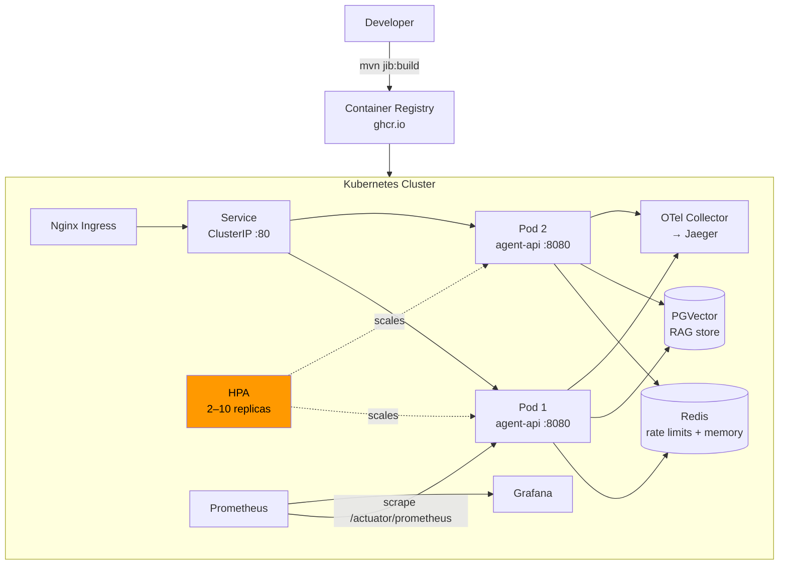

# Module 13 — Deployment

> **Prerequisite**: [Module 12 — Evaluation and Testing](../12-evaluation-and-testing/README.md)

## Learning Objectives
- Build a production Docker image using Jib (no Dockerfile required).
- Deploy to Kubernetes with liveness/readiness probes, HPA, and PodDisruptionBudget.
- Package the deployment with a Helm chart for repeatable, parameterized releases.
- Configure OTel sampling, Redis-backed rate limits, and secrets management for production.
- Run a smoke test script to verify a deployment is healthy.

## Architecture



## Key Concepts

### Jib — Dockerfile-free image builds
Jib builds optimized, layered Docker images directly from Maven without a Docker daemon or Dockerfile:

```bash
# Build and push to registry
./mvnw -pl 13-deployment jib:build \
  -Ddocker.registry=ghcr.io/your-org \
  -Djib.to.auth.username=$GITHUB_USER \
  -Djib.to.auth.password=$GITHUB_TOKEN
```

Jib layers: JRE base → Spring Boot dependencies → project classes → resources. Only changed layers are pushed, making pushes fast.

### Liveness vs Readiness probes
Spring Boot Actuator exposes separate probe endpoints when `management.endpoint.health.probes.enabled: true`:
- **`/actuator/health/liveness`**: is the JVM alive? Kubernetes restarts the pod if this fails.
- **`/actuator/health/readiness`**: is the app ready to receive traffic? Kubernetes removes the pod from the Service endpoints if this fails (e.g., during startup or when a dependency is down).

### Horizontal Pod Autoscaler
The HPA scales from 2 to 10 replicas based on CPU (70% target). For LLM workloads, CPU is a reasonable proxy for load since most of the latency is external (OpenAI/Ollama) but parsing + auth + rate-limit checks consume CPU.

If you have custom Prometheus metrics (`gen_ai.client.token.usage`), you can use KEDA with a Prometheus trigger to scale on token throughput instead.

### Redis-backed rate limiting at scale
In-process Bucket4j (used in modules 01–06) fails under horizontal scaling — each pod has its own buckets, so a user can send 3× the configured RPS across 3 pods. Module 07 introduced Redis-backed Bucket4j. In production:

```yaml
spring:
  redis:
    host: ${REDIS_HOST:redis}
    port: 6379
```

The `RateLimitConfig` in `shared/` auto-selects the Redis backend when a `RedissonClient` bean is present.

### OTel sampling in production
Module 08 used `sampling.probability: 1.0` (trace every request) for learning. In production set it to `0.1` (10%). For high-value paths (errors, slow requests), use tail-based sampling in the OTel Collector.

### Secrets management
Never put real secrets in `values.yaml`. Options (in order of increasing security):
1. `helm install --set secrets.openaiApiKey=sk-...` (ok for dev)
2. Kubernetes Sealed Secrets (encrypted in Git)
3. External Secrets Operator + AWS Secrets Manager / Vault (production standard)

## How to Run

```bash
# 1. Build image with Jib
./mvnw -pl 13-deployment jib:dockerBuild  # local Docker daemon
# OR push to registry:
# ./mvnw -pl 13-deployment jib:build -Ddocker.registry=ghcr.io/your-org

# 2. Create a local K8s cluster (kind)
kind create cluster --name agents

# 3. Deploy with kubectl
kubectl apply -f 13-deployment/k8s/namespace.yml
kubectl apply -f 13-deployment/k8s/secrets.yml    # edit first with real values!
kubectl apply -f 13-deployment/k8s/deployment.yml
kubectl apply -f 13-deployment/k8s/service.yml
kubectl apply -f 13-deployment/k8s/hpa.yml

# 4. OR deploy with Helm
helm install agent-api 13-deployment/helm \
  --namespace ai-agents --create-namespace \
  --set secrets.openaiApiKey=$OPENAI_API_KEY \
  --set secrets.jwtSecret=$JWT_SECRET

# 5. Port-forward and smoke test
kubectl port-forward svc/agent-api 8080:80 -n ai-agents &
./13-deployment/scripts/smoke-test.sh http://localhost:8080
```

## Code Walkthrough

| File | Purpose |
|---|---|
| `pom.xml` | Jib plugin config — base image, ports, JVM flags |
| `application.yml` | Production-safe config: liveness/readiness probes, OTel 10% sampling |
| `k8s/namespace.yml` | K8s namespace `ai-agents` |
| `k8s/deployment.yml` | 2-replica Deployment with liveness/readiness probes + resource limits |
| `k8s/service.yml` | ClusterIP Service + Nginx Ingress |
| `k8s/hpa.yml` | HPA (2–10 replicas, 70% CPU) + PodDisruptionBudget |
| `k8s/secrets.yml` | Secret template — replace values before applying |
| `helm/` | Full Helm chart parameterising all of the above |
| `scripts/smoke-test.sh` | 6-step post-deploy verification script |

## Common Pitfalls
- **`JWT_SECRET` has no default**: unlike dev modules, production `application.yml` intentionally omits the fallback. The pod will fail to start without the secret — which is the desired behavior.
- **HPA with LLM workloads**: latency is dominated by LLM call time, not CPU. Consider scaling on queue depth or token throughput using KEDA rather than CPU.
- **Readiness probe too aggressive**: if `initialDelaySeconds` is too short, the pod gets removed from the load balancer before the JVM warms up. 20s is conservative; increase for slower machines.
- **OTel 100% sampling in production**: will overwhelm Jaeger and incur storage costs. Always set `sampling.probability: 0.1` or lower in production.
- **Jib base image**: `eclipse-temurin:21-jre` is ~250MB. For smaller images use `eclipse-temurin:21-jre-alpine` or a GraalVM native image.

## Further Reading
- [Jib Maven Plugin docs](https://github.com/GoogleContainerTools/jib/tree/master/jib-maven-plugin)
- [Spring Boot Kubernetes health probes](https://docs.spring.io/spring-boot/docs/current/reference/html/actuator.html#actuator.endpoints.kubernetes-probes)
- [KEDA — Kubernetes Event-driven Autoscaling](https://keda.sh/)
- [External Secrets Operator](https://external-secrets.io/)
- [OTel tail-based sampling](https://opentelemetry.io/docs/collector/configuration/#tail_sampling)

## What's Next
Explore the capstone example projects:
- [`examples/customer-support-agent/`](../examples/customer-support-agent/) — tool-calling + RAG + memory
- [`examples/banking-assistant/`](../examples/banking-assistant/) — multi-agent supervisor + HITL
- [`examples/research-agent/`](../examples/research-agent/) — LangChain4j agentic + web tools
