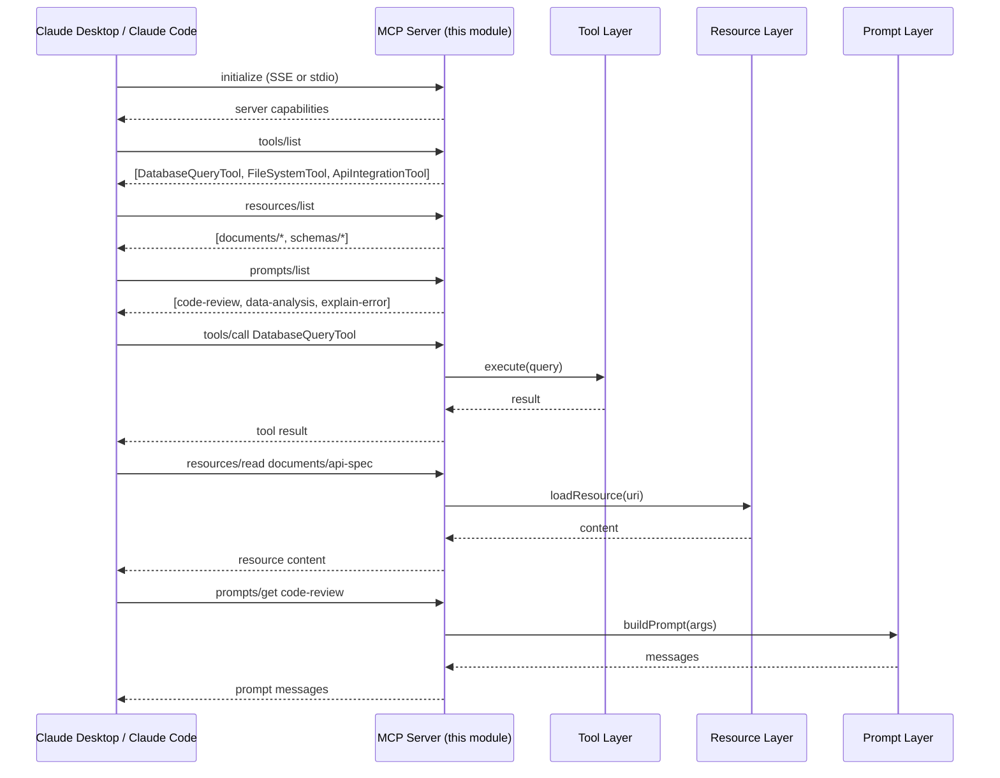
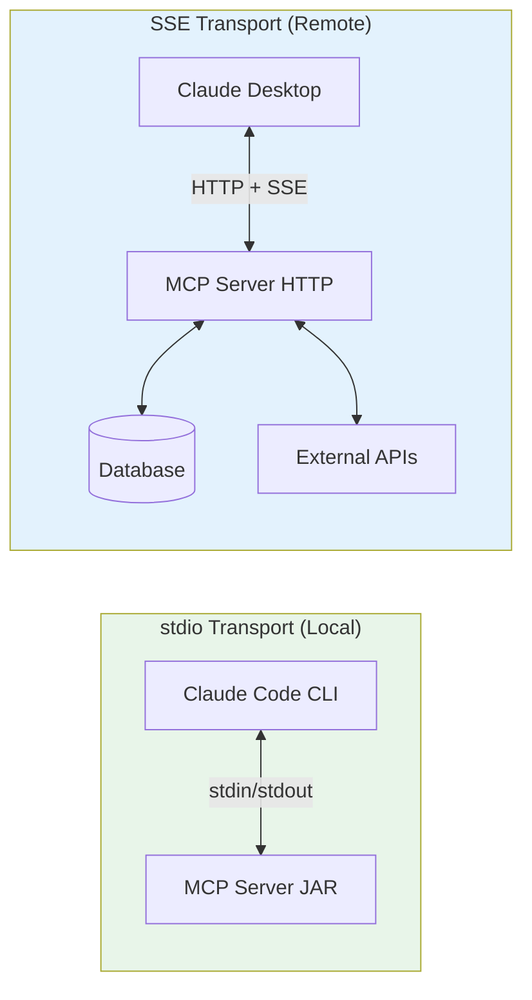

# Module 14 — Building MCP Servers with Spring AI

> **Prerequisite**: [Module 10 — Multi-Agent Supervisor](../10-multi-agent-supervisor/README.md). Familiarity with the [Model Context Protocol spec](https://modelcontextprotocol.io).

## Learning Objectives

- Understand the **Model Context Protocol (MCP)** — why it exists and how it bridges AI clients and your Java services.
- Build a production MCP server using Spring AI's `spring-ai-mcp-server-webmvc-spring-boot-starter`.
- Expose **Tools**, **Resources**, and **Prompts** as MCP primitives from a Spring Boot application.
- Connect your MCP server to **Claude Desktop**, **Claude Code**, or any MCP-compatible client.
- Choose between `stdio` transport (local CLI tools) and `SSE/HTTP` transport (remote services).
- Secure your MCP server with JWT bearer tokens so it is safe to deploy remotely.

## Prerequisites

| Requirement | Check |
|---|---|
| Module 10 completed | Multi-agent patterns understood |
| Claude Desktop installed | [Download](https://claude.ai/download) (optional — for live demo) |
| JDK 21+ | `java -version` |
| Docker + Compose | `docker compose up -d` at repo root |

## Architecture



### MCP Transport Comparison



## Key Concepts

### What is MCP?
The **Model Context Protocol** (published by Anthropic, Nov 2024) is an open standard that defines how AI applications discover and call **tools**, read **resources**, and use **prompt templates** from external servers. Think of it as the "USB-C of AI integrations" — one standard that any MCP-compatible client can use with any MCP-compatible server.

**Three MCP primitives:**
| Primitive | Purpose | Example |
|-----------|---------|---------|
| **Tools** | Functions the LLM can call to take actions | `query_database`, `send_email`, `create_file` |
| **Resources** | Static or dynamic content the LLM can read | API specs, documents, database schemas |
| **Prompts** | Reusable prompt templates with parameters | `code-review`, `summarise-ticket`, `explain-error` |

### stdio vs SSE Transport
- **stdio**: The MCP client spawns your server JAR as a child process and communicates via stdin/stdout. Perfect for local developer tools (no auth needed).
- **SSE (Server-Sent Events)**: Your server runs as a normal HTTP service. Clients connect over HTTP, send requests as POST, receive responses as SSE stream. Required for remote/shared deployments.

### Spring AI MCP Integration
Spring AI auto-discovers `@Tool`-annotated methods and registers them as MCP tools. You add resources via `McpServerFeatures.SyncResourceRegistration` beans, and prompts via `McpServerFeatures.SyncPromptRegistration` beans.

## How to Run

### SSE Transport (HTTP server — recommended)
```bash
# Start with local LLM
./mvnw -pl 14-mcp-server spring-boot:run -Dspring-boot.run.profiles=local

# The MCP server listens at:
#   GET  http://localhost:8014/sse      ← SSE endpoint (client subscribes here)
#   POST http://localhost:8014/message  ← JSON-RPC messages

# Test with curl
curl -N http://localhost:8014/sse

# Get tool list
curl -X POST http://localhost:8014/message \
  -H 'Content-Type: application/json' \
  -d '{"jsonrpc":"2.0","id":1,"method":"tools/list"}'
```

### stdio Transport (local JAR)
```bash
./mvnw -pl 14-mcp-server package -DskipTests
# Then configure Claude Desktop (see below)
```

### Connect to Claude Desktop
Add to `~/Library/Application Support/Claude/claude_desktop_config.json` (macOS) or  
`%APPDATA%\Claude\claude_desktop_config.json` (Windows):

```json
{
  "mcpServers": {
    "java-masterclass": {
      "command": "java",
      "args": [
        "-jar",
        "/path/to/14-mcp-server/target/14-mcp-server-1.0.0-SNAPSHOT.jar",
        "--spring.profiles.active=local",
        "--mcp.transport=stdio"
      ]
    }
  }
}
```

### Connect to Claude Code (SSE)
```bash
# Add to your project's .claude/settings.json
{
  "mcpServers": {
    "java-masterclass": {
      "type": "sse",
      "url": "http://localhost:8014/sse"
    }
  }
}
```

## Code Walkthrough

| File | Role |
|------|------|
| `McpServerApplication.java` | Spring Boot entry point; configures MCP transport |
| `McpServerConfig.java` | Registers Resource and Prompt beans |
| `tool/DatabaseQueryTool.java` | MCP Tool — safe read-only SQL queries |
| `tool/FileSystemTool.java` | MCP Tool — sandboxed file operations |
| `tool/ApiIntegrationTool.java` | MCP Tool — HTTP API calls with circuit breaker |
| `resource/DocumentResourceProvider.java` | MCP Resources — exposes static docs |
| `resource/SchemaResourceProvider.java` | MCP Resources — exposes DB schema |
| `prompt/CodeReviewPromptProvider.java` | MCP Prompt — parameterised code review template |
| `prompt/DataAnalysisPromptProvider.java` | MCP Prompt — data analysis template |

## Common Pitfalls

- **Tool descriptions must be written for the LLM, not for you.** The LLM reads the `description` field to decide when to call the tool. Be specific about inputs, outputs, and when NOT to use the tool.
- **stdio transport blocks the process.** Never add interactive prompts or spinners when running in stdio mode.
- **SSE connections are long-lived.** Your load balancer must allow persistent connections (disable idle timeouts or use sticky sessions).
- **Resources vs Tools**: Use Resources for content the LLM passively reads (docs, schemas). Use Tools for actions that have side effects or need fresh data.
- **Spring AI auto-discovers `@Tool` beans** — if your tool bean is `@Conditional`, make sure the condition is met or MCP will silently omit the tool.
- **Authentication**: In production, always add JWT validation in front of the `/message` endpoint. The SSE `/sse` endpoint can be public (it only establishes the connection).

## Further Reading

- [Model Context Protocol Specification](https://spec.modelcontextprotocol.io)
- [Spring AI MCP Docs](https://docs.spring.io/spring-ai/reference/api/mcp/mcp-server-boot-starter-docs.html)
- [Anthropic MCP Announcement](https://www.anthropic.com/news/model-context-protocol)
- [MCP GitHub](https://github.com/modelcontextprotocol)

## What's Next

[Module 15 — Connecting to Multiple LLM Providers](../15-multi-llm-providers/README.md)
