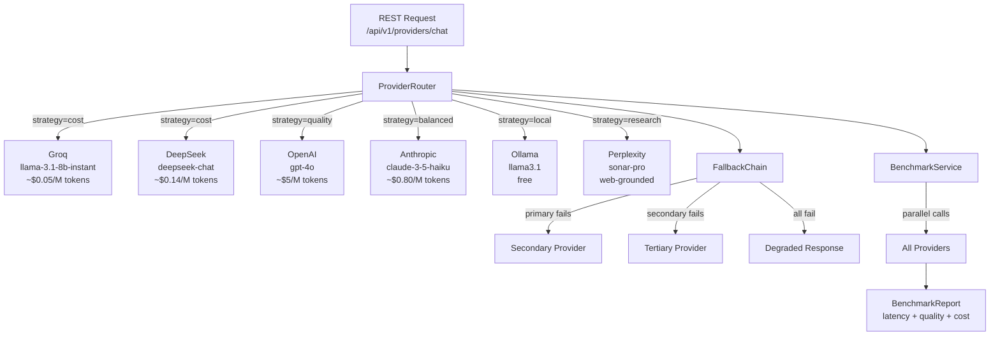
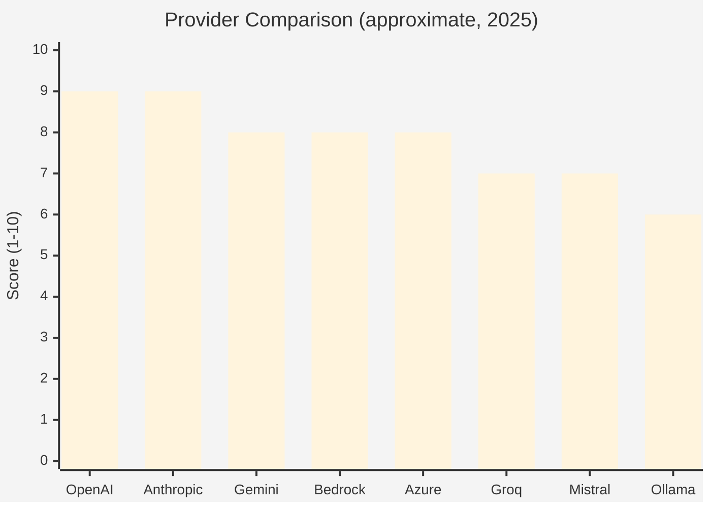

# Module 15 — Connecting to Multiple LLM Providers

> **Prerequisite**: [Module 01 — Hello Agent](../01-hello-agent/README.md) and a basic understanding of `ChatClient`.

## Learning Objectives

- Configure Spring AI to connect to **11+ LLM providers** from a single codebase: OpenAI, Anthropic Claude, Google Gemini, AWS Bedrock, Azure OpenAI, Groq, Mistral AI, DeepSeek, Together AI, Perplexity AI, and Ollama.
- Implement a **provider router** that selects the best model per request type (cost, speed, capability).
- Build a **fallback chain**: if the primary provider fails, automatically retry on the next available one.
- Run **head-to-head benchmarks** across providers to measure quality, latency, and token cost.
- Stream responses from any provider using `Flux<String>` (Server-Sent Events to the browser).
- Never hardcode a provider in business logic — use Spring profiles and `@ConditionalOnProperty` to swap providers at deploy time.
- Tune AI response quality at runtime using `temperature`, `maxTokens`, `topP`, `topK`, and `stopSequences` without redeploying.
- Understand how each parameter affects output: compare same prompt at different temperatures side by side.

## Prerequisites

| Requirement | Check |
|---|---|
| Module 01 completed | `ChatClient` basics understood |
| At least one API key | OpenAI, Anthropic, Google, or local Ollama |
| JDK 21+ | `java -version` |
| Docker (for Ollama) | `docker compose up -d` |

## Architecture



### Provider Capability Matrix



## LLM Provider Cheat Sheet

| Provider | Best For | Model Examples | Pricing (input/M) | Notes |
|----------|----------|----------------|-------------------|-------|
| **OpenAI** | General purpose, function calling | `gpt-4o`, `gpt-4o-mini`, `o1-mini` | $2.50 / $0.15 | Industry baseline |
| **Anthropic Claude** | Long context, coding, safety | `claude-3-5-sonnet`, `claude-3-5-haiku` | $3 / $0.80 | 200K context window |
| **Google Gemini** | Multimodal, long context | `gemini-1.5-pro`, `gemini-1.5-flash` | $1.25 / $0.075 | 1M context window |
| **AWS Bedrock** | Enterprise, data privacy | Claude, Llama, Mistral, Titan | Varies | No data leaves AWS |
| **Azure OpenAI** | Enterprise + OpenAI models | Same as OpenAI | Same as OpenAI | VNET, private deployment |
| **Groq** | Ultra-fast inference | `llama-3.1-70b-versatile`, `mixtral-8x7b` | ~$0.59 | 400+ tokens/sec |
| **Mistral AI** | European data sovereignty | `mistral-large`, `mistral-small` | $2 / $0.10 | GDPR-friendly |
| **Ollama** | Local, no-cost, private | `llama3.1`, `mistral`, `codellama` | Free | Runs on your hardware |
| **DeepSeek** | Reasoning tasks at low cost | `deepseek-chat`, `deepseek-reasoner` | $0.14 / $0.55 | OpenAI-compatible API |
| **Together AI** | 100+ open models, cloud | `Llama-3.1-70B-Turbo`, `Qwen2.5-72B` | $0.90 | OpenAI-compatible API |
| **Perplexity** | Web-grounded factual answers | `sonar-pro`, `sonar-reasoning-pro` | $3 | Real-time web search |

> **OpenAI-compatible providers** (Groq, DeepSeek, Together AI, Perplexity) all use the same
> `OpenAiApi` + `OpenAiChatModel` bean with a custom `baseUrl`. No extra Maven dependency needed.

## Response Configuration Guide

Spring AI lets you override model parameters per request using `ChatOptionsBuilder`.
These are set at call time — they override the `application.yml` defaults without redeploying.

| Parameter | Range | Effect | Use case |
|-----------|-------|--------|----------|
| `temperature` | 0.0–2.0 | Randomness / creativity | 0.1 for facts, 0.7 for chat, 1.0+ for creative |
| `maxTokens` | 1–8192 | Hard cap on response length | Control cost; 1 token ≈ 0.75 English words |
| `topP` | 0.0–1.0 | Nucleus sampling threshold | Alternative to temperature; 0.9 is safe default |
| `topK` | 1–200 | Limit vocabulary at each step | More control over variance; not all providers support it |
| `stopSequences` | list of strings | Stop when output matches | Structured extraction, first-sentence-only, JSON delimiters |

```java
// Runtime override — no bean changes needed
client.prompt()
      .user(prompt)
      .options(ChatOptionsBuilder.builder()
          .temperature(0.1)   // deterministic
          .maxTokens(256)     // short answer
          .build())
      .call()
      .content();
```

## How to Run

### Local (Ollama only — no API keys needed)
```bash
./mvnw -pl 15-multi-llm-providers spring-boot:run -Dspring-boot.run.profiles=local
```

### Cloud (one provider)
```bash
export OPENAI_API_KEY=sk-...
./mvnw -pl 15-multi-llm-providers spring-boot:run -Dspring-boot.run.profiles=openai
```

### Cloud (all providers for benchmarking)
```bash
export OPENAI_API_KEY=sk-...
export ANTHROPIC_API_KEY=sk-ant-...
export GROQ_API_KEY=gsk_...
export DEEPSEEK_API_KEY=sk-...
export TOGETHER_API_KEY=...
export PERPLEXITY_API_KEY=pplx-...
./mvnw -pl 15-multi-llm-providers spring-boot:run -Dspring-boot.run.profiles=all-providers
```

### API Endpoints

```bash
# ── Provider routing ────────────────────────────────────────────────────────
# Route to best provider for a given strategy
curl -X POST http://localhost:8015/api/v1/providers/chat \
  -H 'Authorization: Bearer <jwt>' \
  -H 'Content-Type: application/json' \
  -d '{"message": "Explain RAG in one paragraph", "strategy": "balanced"}'

# Streaming response (SSE)
curl -N http://localhost:8015/api/v1/providers/stream \
  -H 'Authorization: Bearer <jwt>' \
  -H 'Content-Type: application/json' \
  -d '{"message": "Write me a haiku about Java", "provider": "anthropic"}'

# Run benchmark across all configured providers
curl -X POST http://localhost:8015/api/v1/providers/benchmark \
  -H 'Authorization: Bearer <jwt>' \
  -H 'Content-Type: application/json' \
  -d '{"prompt": "What is the capital of France?", "providers": ["openai","anthropic","groq"]}'

# ── Provider showcase (connect individual providers) ────────────────────────
# Demo DeepSeek
curl -X POST http://localhost:8015/api/v1/providers/showcase/deepseek \
  -H 'Authorization: Bearer <jwt>' \
  -H 'Content-Type: application/json' \
  -d '{"prompt": "What is 17 * 83?"}'

# Demo Groq (fast inference)
curl -X POST http://localhost:8015/api/v1/providers/showcase/groq \
  -H 'Authorization: Bearer <jwt>' \
  -H 'Content-Type: application/json' \
  -d '{"prompt": "Summarize TCP/IP in 3 bullet points"}'

# Demo Perplexity (web-grounded)
curl -X POST http://localhost:8015/api/v1/providers/showcase/perplexity \
  -H 'Authorization: Bearer <jwt>' \
  -H 'Content-Type: application/json' \
  -d '{"prompt": "What are the latest Spring AI release notes?"}'

# ── Response configuration demos ────────────────────────────────────────────
# Full control over temperature, maxTokens, topP, topK, stop sequences
curl -X POST http://localhost:8015/api/v1/providers/showcase/tune \
  -H 'Authorization: Bearer <jwt>' \
  -H 'Content-Type: application/json' \
  -d '{
    "prompt": "Give me three ideas for a startup",
    "provider": "openai",
    "temperature": 1.2,
    "maxTokens": 300,
    "topP": null,
    "stopSequences": ["4."]
  }'

# Compare same prompt at temperature 0.0, 0.5, 1.0
curl -X POST http://localhost:8015/api/v1/providers/showcase/compare-temperatures \
  -H 'Authorization: Bearer <jwt>' \
  -H 'Content-Type: application/json' \
  -d '{"prompt": "Write a one-sentence tagline for a coffee shop", "provider": "openai"}'

# Factual preset (temperature=0.1, maxTokens=512)
curl -X POST http://localhost:8015/api/v1/providers/showcase/preset/factual \
  -H 'Authorization: Bearer <jwt>' \
  -H 'Content-Type: application/json' \
  -d '{"prompt": "What is the boiling point of water in Celsius?"}'

# Stop sequence demo — stops output when "###" appears
curl -X POST http://localhost:8015/api/v1/providers/showcase/stop-sequence \
  -H 'Authorization: Bearer <jwt>' \
  -H 'Content-Type: application/json' \
  -d '{"prompt": "List 5 planets. After each one write ###", "stopAt": "###"}'
```

## Code Walkthrough

| File | Role |
|------|------|
| `config/ProviderConfig.java` | `@Bean` definitions for each provider's `ChatModel` (11 providers) |
| `router/ProviderRouter.java` | Selects `ChatClient` based on routing strategy |
| `router/RoutingStrategy.java` | Enum: COST, QUALITY, BALANCED, LOCAL, RESEARCH, EXPLICIT |
| `fallback/FallbackChainService.java` | Tries providers in order until one succeeds |
| `benchmark/ProviderBenchmarkService.java` | Parallel execution + result comparison |
| `benchmark/BenchmarkReport.java` | Record: provider, latency, tokens, estimated cost |
| `streaming/StreamingService.java` | SSE streaming using `Flux<String>` |
| `tuning/ResponseTuningService.java` | Runtime parameter overrides (temperature, maxTokens, topP, topK, stop) |
| `tuning/ResponseConfig.java` | Record of all tunable parameters + preset factories |
| `showcase/ProviderShowcaseController.java` | Educational endpoints: per-provider demos + response tuning demos |
| `ProviderController.java` | Main routing controller |

### How OpenAI-compatible providers work

DeepSeek, Together AI, Perplexity AI, and Groq all expose an OpenAI-compatible REST API.
Spring AI's `OpenAiChatModel` can connect to any of them by overriding `baseUrl`:

```java
var api = OpenAiApi.builder()
        .baseUrl("https://api.deepseek.com")  // ← change this per provider
        .apiKey(System.getenv("DEEPSEEK_API_KEY"))
        .build();
var model = OpenAiChatModel.builder()
        .openAiApi(api)
        .defaultOptions(OpenAiChatOptions.builder()
                .model("deepseek-chat")
                .temperature(0.7)
                .build())
        .build();
ChatClient client = ChatClient.builder(model).build();
```

This means adding a new OpenAI-compatible provider costs ~8 lines of code and one env var.

## Common Pitfalls

- **Different providers have different system prompt support.** Some (older Mistral versions) ignore the system role. Always test your prompts on each provider you intend to support.
- **Token counting differs.** OpenAI uses tiktoken; Anthropic counts differently. Budget 20% extra when estimating cross-provider costs.
- **Streaming and function calling.** Not all providers support streaming + tool use simultaneously. Check provider docs before combining both.
- **Rate limits vary wildly.** Groq is fast but has strict RPM limits on free tiers. Implement per-provider rate limiting, not just a global bucket.
- **Model names are not portable.** `gpt-4o` is OpenAI only. Use the router/config to map logical names (`large`, `small`, `fast`) to provider-specific model IDs.
- **AWS Bedrock requires region + IAM.** The `spring-ai-bedrock-converse` starter needs `AWS_REGION` and AWS credentials — not just an API key.
- **Don't set both `temperature` and `topP`.** They are alternative sampling strategies. Pick one; mixing them often behaves unexpectedly depending on the provider.
- **`stopSequences` are provider-dependent.** Not all providers respect them reliably. Test on each provider you support.
- **DeepSeek reasoner (`deepseek-reasoner`) adds a thinking block.** The full chain-of-thought is billed but only the final answer is returned in `content()`. Factor this into cost estimates.
- **Perplexity injects citations into the response.** Parse or strip `[1]`, `[2]` markers if presenting to end-users.
- **Together AI model names change.** Check `https://api.together.xyz/v1/models` for the current model list — names are updated frequently as new models are added.

## Further Reading

- [Spring AI — OpenAI](https://docs.spring.io/spring-ai/reference/api/chat/openai-chat.html)
- [Spring AI — Anthropic](https://docs.spring.io/spring-ai/reference/api/chat/anthropic-chat.html)
- [Spring AI — Google Vertex AI Gemini](https://docs.spring.io/spring-ai/reference/api/chat/vertexai-gemini-chat.html)
- [Spring AI — AWS Bedrock](https://docs.spring.io/spring-ai/reference/api/bedrock-converse.html)
- [Spring AI — Mistral](https://docs.spring.io/spring-ai/reference/api/chat/mistralai-chat.html)
- [Groq API Docs](https://console.groq.com/docs)
- [Ollama REST API](https://github.com/ollama/ollama/blob/main/docs/api.md)

## What's Next

You've completed the core masterclass modules. See the [examples/](../examples/) folder for complete, production-grade reference applications:
- [Customer Support Agent](../examples/customer-support-agent/)
- [Banking Assistant](../examples/banking-assistant/)
- [Research Agent](../examples/research-agent/)
