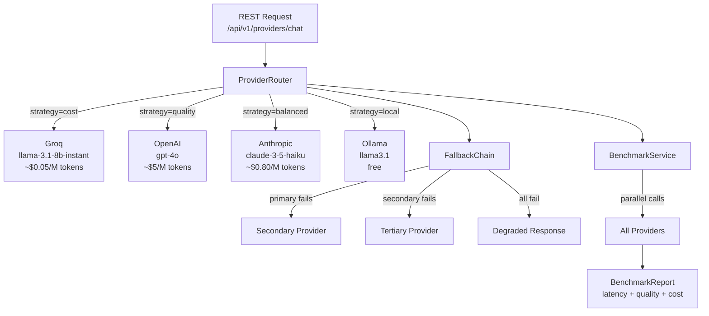
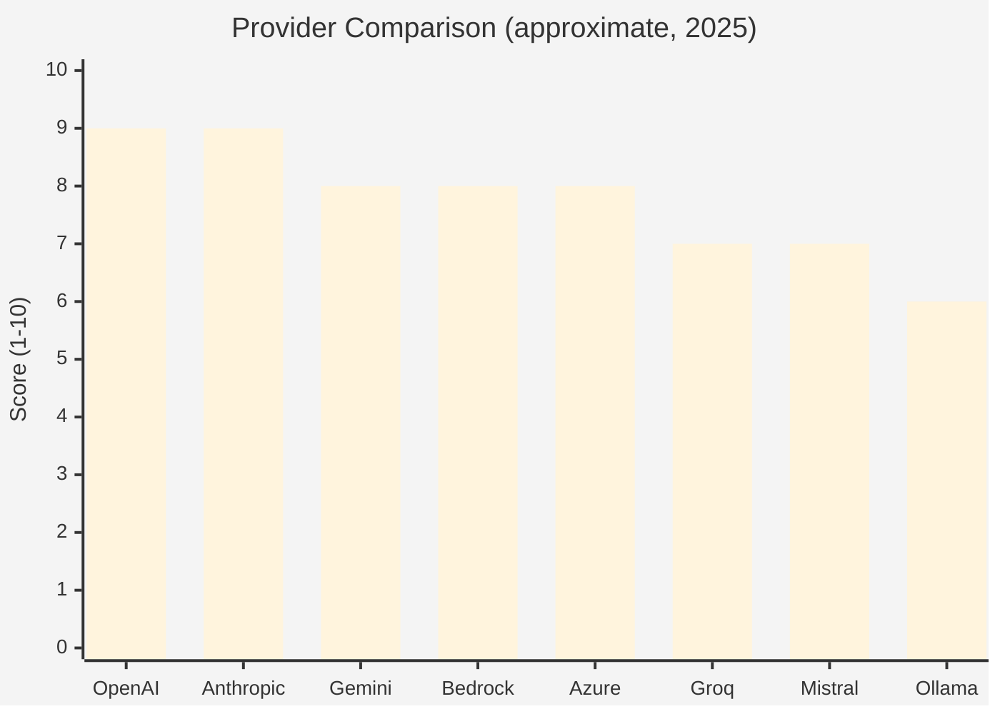

# Module 15 — Connecting to Multiple LLM Providers

> **Prerequisite**: [Module 01 — Hello Agent](../01-hello-agent/README.md) and a basic understanding of `ChatClient`.

## Learning Objectives

- Configure Spring AI to connect to **8+ LLM providers** from a single codebase: OpenAI, Anthropic Claude, Google Gemini, AWS Bedrock, Azure OpenAI, Groq, Mistral AI, and Ollama.
- Implement a **provider router** that selects the best model per request type (cost, speed, capability).
- Build a **fallback chain**: if the primary provider fails, automatically retry on the next available one.
- Run **head-to-head benchmarks** across providers to measure quality, latency, and token cost.
- Stream responses from any provider using `Flux<String>` (Server-Sent Events to the browser).
- Never hardcode a provider in business logic — use Spring profiles and `@ConditionalOnProperty` to swap providers at deploy time.

## Prerequisites

| Requirement | Check |
|---|---|
| Module 01 completed | `ChatClient` basics understood |
| At least one API key | OpenAI, Anthropic, Google, or local Ollama |
| JDK 21+ | `java -version` |
| Docker (for Ollama) | `docker compose up -d` |

## Architecture



### Provider Capability Matrix



## LLM Provider Cheat Sheet

| Provider | Best For | Model Examples | Pricing (input/M) | Notes |
|----------|----------|----------------|-------------------|-------|
| **OpenAI** | General purpose, function calling | `gpt-4o`, `gpt-4o-mini`, `o1-mini` | $2.50 / $0.15 | Industry baseline |
| **Anthropic Claude** | Long context, coding, safety | `claude-3-5-sonnet`, `claude-3-5-haiku` | $3 / $0.80 | 200K context window |
| **Google Gemini** | Multimodal, long context | `gemini-1.5-pro`, `gemini-1.5-flash` | $1.25 / $0.075 | 1M context window |
| **AWS Bedrock** | Enterprise, data privacy | Claude, Llama, Mistral, Titan | Varies | No data leaves AWS |
| **Azure OpenAI** | Enterprise + OpenAI models | Same as OpenAI | Same as OpenAI | VNET, private deployment |
| **Groq** | Ultra-fast inference | `llama-3.1-70b-versatile`, `mixtral-8x7b` | ~$0.59 | 400+ tokens/sec |
| **Mistral AI** | European data sovereignty | `mistral-large`, `mistral-small` | $2 / $0.10 | GDPR-friendly |
| **Ollama** | Local, no-cost, private | `llama3.1`, `mistral`, `codellama` | Free | Runs on your hardware |

## How to Run

### Local (Ollama only — no API keys needed)
```bash
./mvnw -pl 15-multi-llm-providers spring-boot:run -Dspring-boot.run.profiles=local
```

### Cloud (one provider)
```bash
export OPENAI_API_KEY=sk-...
./mvnw -pl 15-multi-llm-providers spring-boot:run -Dspring-boot.run.profiles=openai
```

### Cloud (all providers for benchmarking)
```bash
export OPENAI_API_KEY=sk-...
export ANTHROPIC_API_KEY=sk-ant-...
export GEMINI_API_KEY=AIza...
export GROQ_API_KEY=gsk_...
export MISTRAL_API_KEY=...
./mvnw -pl 15-multi-llm-providers spring-boot:run -Dspring-boot.run.profiles=all-providers
```

### API Endpoints

```bash
# Route to best provider for a given strategy
curl -X POST http://localhost:8015/api/v1/providers/chat \
  -H 'Authorization: Bearer <jwt>' \
  -H 'Content-Type: application/json' \
  -d '{"message": "Explain RAG in one paragraph", "strategy": "balanced"}'

# Streaming response (SSE)
curl -N http://localhost:8015/api/v1/providers/stream \
  -H 'Authorization: Bearer <jwt>' \
  -H 'Content-Type: application/json' \
  -d '{"message": "Write me a haiku about Java", "provider": "anthropic"}'

# Run benchmark across all configured providers
curl -X POST http://localhost:8015/api/v1/providers/benchmark \
  -H 'Authorization: Bearer <jwt>' \
  -H 'Content-Type: application/json' \
  -d '{"prompt": "What is the capital of France?", "providers": ["openai","anthropic","groq"]}'
```

## Code Walkthrough

| File | Role |
|------|------|
| `config/ProviderConfig.java` | `@Bean` definitions for each provider's `ChatModel` |
| `router/ProviderRouter.java` | Selects `ChatClient` based on routing strategy |
| `router/RoutingStrategy.java` | Enum: COST, QUALITY, BALANCED, LOCAL, EXPLICIT |
| `fallback/FallbackChainService.java` | Tries providers in order until one succeeds |
| `benchmark/ProviderBenchmarkService.java` | Parallel execution + result comparison |
| `benchmark/BenchmarkReport.java` | Record: provider, latency, tokens, estimated cost |
| `streaming/StreamingController.java` | SSE streaming endpoint using `Flux<String>` |
| `ProviderController.java` | Main REST controller |

## Common Pitfalls

- **Different providers have different system prompt support.** Some (older Mistral versions) ignore the system role. Always test your prompts on each provider you intend to support.
- **Token counting differs.** OpenAI uses tiktoken; Anthropic counts differently. Budget 20% extra when estimating cross-provider costs.
- **Streaming and function calling.** Not all providers support streaming + tool use simultaneously. Check provider docs before combining both.
- **Rate limits vary wildly.** Groq is fast but has strict RPM limits on free tiers. Implement per-provider rate limiting, not just a global bucket.
- **Model names are not portable.** `gpt-4o` is OpenAI only. Use the router/config to map logical names (`large`, `small`, `fast`) to provider-specific model IDs.
- **AWS Bedrock requires region + IAM.** The `spring-ai-bedrock-converse` starter needs `AWS_REGION` and AWS credentials — not just an API key.

## Further Reading

- [Spring AI — OpenAI](https://docs.spring.io/spring-ai/reference/api/chat/openai-chat.html)
- [Spring AI — Anthropic](https://docs.spring.io/spring-ai/reference/api/chat/anthropic-chat.html)
- [Spring AI — Google Vertex AI Gemini](https://docs.spring.io/spring-ai/reference/api/chat/vertexai-gemini-chat.html)
- [Spring AI — AWS Bedrock](https://docs.spring.io/spring-ai/reference/api/bedrock-converse.html)
- [Spring AI — Mistral](https://docs.spring.io/spring-ai/reference/api/chat/mistralai-chat.html)
- [Groq API Docs](https://console.groq.com/docs)
- [Ollama REST API](https://github.com/ollama/ollama/blob/main/docs/api.md)

## What's Next

You've completed the core masterclass modules. See the [examples/](../examples/) folder for complete, production-grade reference applications:
- [Customer Support Agent](../examples/customer-support-agent/)
- [Banking Assistant](../examples/banking-assistant/)
- [Research Agent](../examples/research-agent/)
