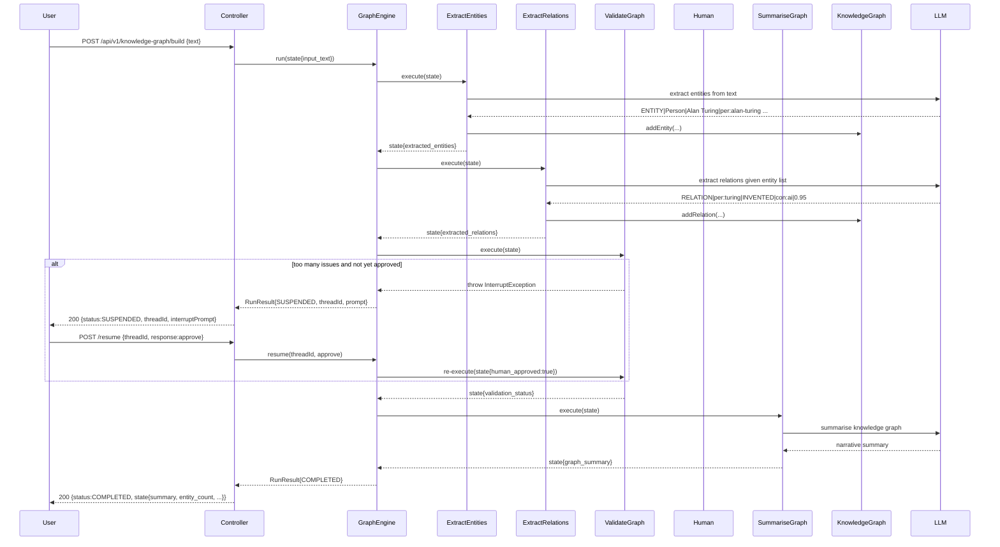
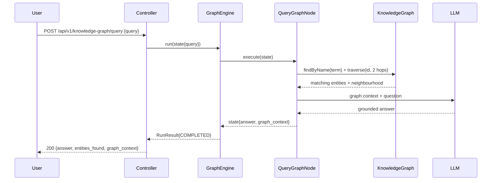
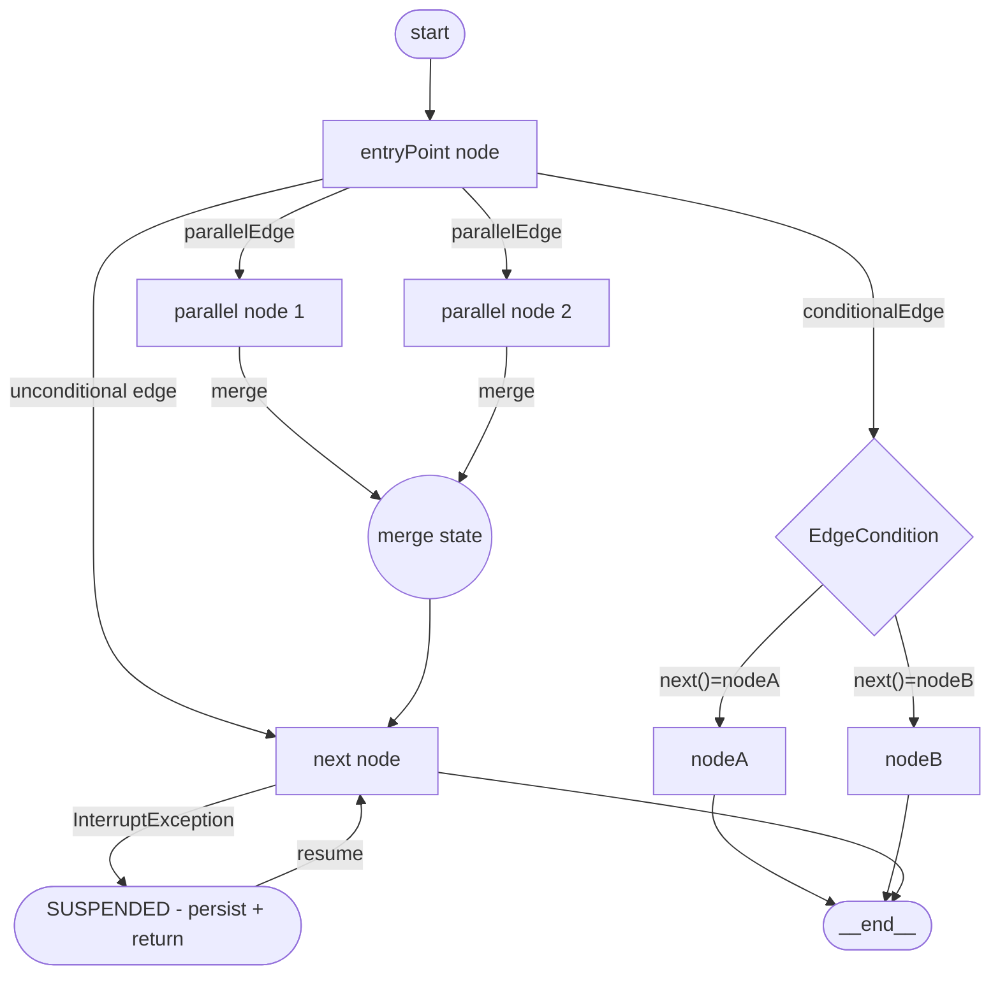

# Module 16 – Knowledge Graph Agent (LangGraph-style)

> **Java doesn't have LangGraph — so we build it from scratch.**

This module implements a complete, production-grade LangGraph equivalent in Java: a typed stateful graph engine with conditional routing, human-in-the-loop interrupts, parallel fan-out, and cycle detection — all driven by Spring AI.

The agent uses this engine to build and query a **knowledge graph** extracted from raw text.

---

## 1. Learning Objectives

- Understand exactly what LangGraph is and why Python developers use it
- Build every LangGraph primitive from scratch in Java: `GraphState`, `GraphNode`, `EdgeCondition`, `InterruptException`, `GraphEngine`
- Implement two production agent pipelines on the engine: **build** (entity + relation extraction) and **query** (multi-hop graph-RAG)
- Apply human-in-the-loop interrupts with resume — the graph pauses for approval and continues after
- Run parallel fan-out nodes and merge their state updates
- Wire full API management: JWT auth, rate limiting, OpenTelemetry, Micrometer metrics

---

## 2. Prerequisites

- Module 10 (multi-agent supervisor) — you should understand agent orchestration
- Module 08 (observability) — Micrometer and OpenTelemetry wiring
- Ollama running locally (`ollama pull llama3.2`) **or** an OpenAI API key

---

## 3. Architecture

### What LangGraph gives you (and what we replicate)

| LangGraph concept       | Our Java equivalent                          |
|-------------------------|----------------------------------------------|
| `StateGraph`            | `GraphEngine.Builder`                        |
| State channels          | `GraphState` (typed map with merge reducers) |
| Node function           | `GraphNode` (functional interface)           |
| Conditional edges       | `EdgeCondition` (functional interface)       |
| `interrupt()`           | `throw new InterruptException(prompt)`       |
| `graph.invoke()`        | `GraphEngine.run(initialState)`              |
| Checkpointer / resume   | `GraphEngine.resume(threadId, response)`     |
| Parallel nodes          | `GraphEngine.Builder.parallelEdge(...)`      |

### Build pipeline (graph construction)



### Query pipeline (graph RAG)



### Graph engine internals



---

## 4. Key Concepts

### GraphState — typed immutable channels

`GraphState` is an immutable map of typed channels. Every node returns a partial state update; the engine merges it into the next state. List values use **append semantics** (LangGraph's `add_messages` pattern): two lists on the same key are concatenated, not replaced. All other values use replace semantics.

```java
// Append semantics — downstream nodes accumulate items into the same list
GraphState s1 = GraphState.of(Map.of("entities", List.of(entityA)));
GraphState s2 = s1.merge(Map.of("entities", List.of(entityB)));
// s2.require("entities") == [entityA, entityB]
```

### EdgeCondition — routing as code

Instead of a fixed graph topology, `EdgeCondition` makes routing dynamic based on current state. This is identical to LangGraph's `add_conditional_edges`:

```java
.conditionalEdge("validate_graph", state -> {
    String humanResponse = state.get("human_response").orElse("approve");
    return humanResponse.equals("reject") ? GraphEngine.END : "summarise_graph";
})
```

### InterruptException — human-in-the-loop

Any node can throw `InterruptException` to pause the graph. The engine catches it, serialises current state + the next node name into an in-memory store (swap for Redis in production), and returns `RunResult{SUSPENDED}`. The caller resumes by calling `GraphEngine.resume(threadId, humanResponse)`.

```java
// Inside ValidateGraphNode
if (issues.size() > maxDanglingAllowed && !humanApproved) {
    throw new InterruptException("Please review these issues: " + issues);
}
```

### Knowledge Graph — structured world model

The `KnowledgeGraph` is an in-memory adjacency list of typed entities and directed relations. BFS traversal (`traverse(startId, maxHops)`) enables multi-hop reasoning. For production, replace with Neo4j + Spring Data Neo4j — the interface stays identical.

---

## 5. How to Run

### Local (Ollama)
```bash
# Start Ollama (if not already running)
ollama pull llama3.2

# Start the module
./mvnw spring-boot:run -pl 16-knowledge-graph -Plocal

# Get a JWT token (uses shared auth endpoint)
TOKEN=$(curl -s -X POST http://localhost:8086/auth/token \
  -H "Content-Type: application/json" \
  -d '{"username":"user","password":"password"}' | jq -r .token)

# Build a knowledge graph from text
curl -X POST http://localhost:8086/api/v1/knowledge-graph/build \
  -H "Authorization: Bearer $TOKEN" \
  -H "Content-Type: application/json" \
  -d '{
    "text": "Alan Turing was a British mathematician who worked at Bletchley Park during World War II. He invented the Turing machine and is considered the father of artificial intelligence and theoretical computer science. Turing worked closely with Gordon Welchman to break the German Enigma cipher."
  }'

# If the response is SUSPENDED, approve it:
curl -X POST http://localhost:8086/api/v1/knowledge-graph/resume \
  -H "Authorization: Bearer $TOKEN" \
  -H "Content-Type: application/json" \
  -d '{"threadId":"<from-above>", "response":"approve"}'

# Query the graph
curl -X POST http://localhost:8086/api/v1/knowledge-graph/query \
  -H "Authorization: Bearer $TOKEN" \
  -H "Content-Type: application/json" \
  -d '{"query": "What did Alan Turing invent?"}'

# Inspect the graph
curl http://localhost:8086/api/v1/knowledge-graph/inspect \
  -H "Authorization: Bearer $TOKEN"
```

### Cloud (OpenAI)
```bash
export OPENAI_API_KEY=sk-...
export JWT_SECRET=your-32-char-secret
./mvnw spring-boot:run -pl 16-knowledge-graph -Pcloud
```

---

## 6. Code Walkthrough

| File | Role |
|------|------|
| `graph/GraphState.java` | Immutable typed state container with append/replace channel semantics |
| `graph/GraphNode.java` | Functional interface — the unit of work in the graph |
| `graph/EdgeCondition.java` | Functional interface — conditional routing based on state |
| `graph/InterruptException.java` | Thrown by a node to pause execution for human review |
| `graph/RunResult.java` | Sealed result: COMPLETED, SUSPENDED, or ERROR |
| `graph/GraphEngine.java` | The engine: builds, validates (cycle detection), and runs graphs |
| `model/KgEntity.java` | Typed knowledge graph node (Person, Org, Concept…) |
| `model/KgRelation.java` | Directed, typed, weighted edge between entities |
| `model/KnowledgeGraph.java` | In-memory graph with BFS traversal and LLM context serialisation |
| `agent/ExtractEntitiesNode.java` | LLM node: extracts entities from text in structured format |
| `agent/ExtractRelationsNode.java` | LLM node: extracts typed relations between known entities |
| `agent/ValidateGraphNode.java` | Validation node with human-in-the-loop interrupt |
| `agent/SummariseGraphNode.java` | LLM node: generates narrative summary of the graph |
| `agent/QueryGraphNode.java` | Graph-RAG node: multi-hop traversal + grounded LLM answer |
| `service/KnowledgeGraphService.java` | Wires both pipelines, exposes `buildGraph`, `resumeBuild`, `query` |
| `controller/KnowledgeGraphController.java` | REST endpoints with JWT auth and OpenAPI docs |

---

## 7. Common Pitfalls

- **Node functions must be stateless** — all mutable state lives in `GraphState`, not in the node object. Nodes are called once per run but the engine is reused across runs.
- **Unconditional cycles are caught at build time** — use `conditionalEdge` if you need loops; `edge(a, b) + edge(b, a)` throws `IllegalStateException`.
- **InterruptException bubbles through CompletableFuture** — if a parallel node throws, it surfaces as an `ExecutionException`; the engine catches this and returns ERROR, not SUSPENDED.
- **GraphState.merge with Lists appends** — if you want replace semantics on a list key, wrap it in a non-List container or use a different key name.
- **In-memory interrupt store** — `GraphEngine` stores suspended runs in a `ConcurrentHashMap`. Restart = lost state. For production, serialise `SuspendedRun` to Redis.
- **LLM output format is fragile** — the `ENTITY|...|...|...` format relies on the LLM following instructions precisely. Always use temperature ≤ 0.1 for extraction nodes and include few-shot examples in the system prompt.
- **Multi-hop traversal can be slow** — the BFS visits every relation; for large graphs, cap `maxHops` at 2 and add entity-specific index lookups before calling `traverse`.

---

## 8. Further Reading

- [LangGraph concepts](https://langchain-ai.github.io/langgraph/concepts/) — the Python original
- [Spring AI ChatClient](https://docs.spring.io/spring-ai/reference/api/chatclient.html)
- [Knowledge Graph construction with LLMs (survey)](https://arxiv.org/abs/2306.08302)
- [Graph-RAG paper (Microsoft)](https://arxiv.org/abs/2404.16130)
- [Neo4j Spring Data](https://docs.spring.io/spring-data/neo4j/docs/current/reference/html/) — production graph DB

---

## 9. What's Next

This module completes the masterclass core curriculum. You now have a full LangGraph-equivalent engine in Java that you can use as the orchestration backbone for any stateful multi-agent system.

**Extension ideas:**
- Swap `KnowledgeGraph` for Neo4j — only `KnowledgeGraphService` needs changes
- Add a `MergeGraphsNode` that reconciles two extractions from different documents
- Implement graph serialisation to JSON-LD and reload on startup (persistent graph)
- Add a `ReasoningNode` that runs multi-step chain-of-thought before querying the graph
