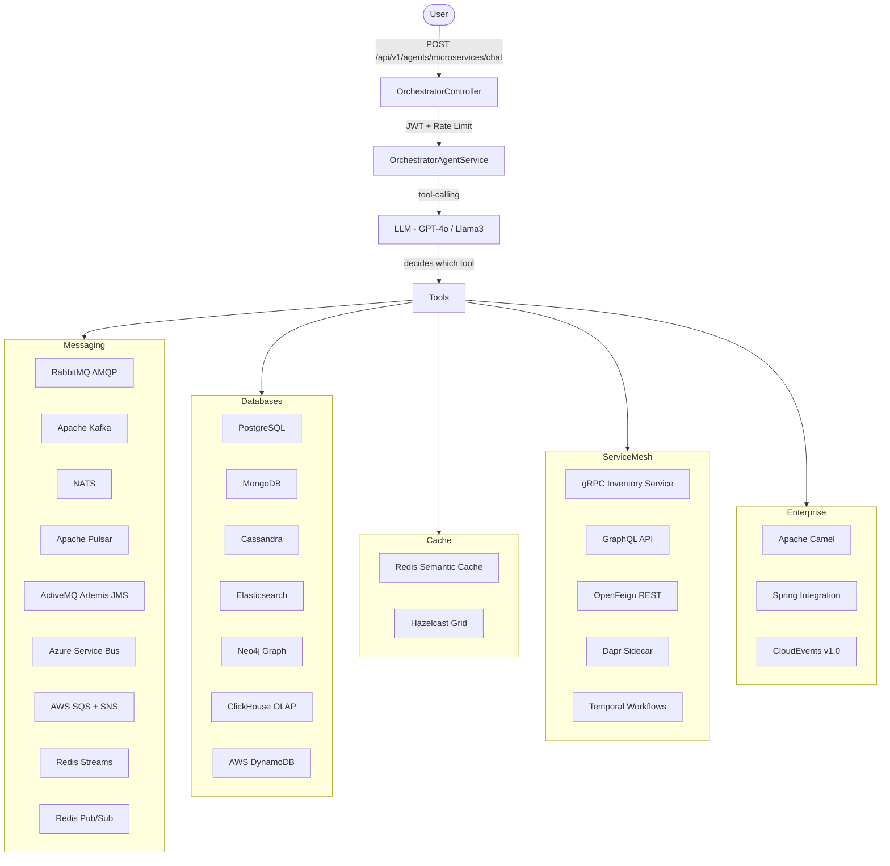
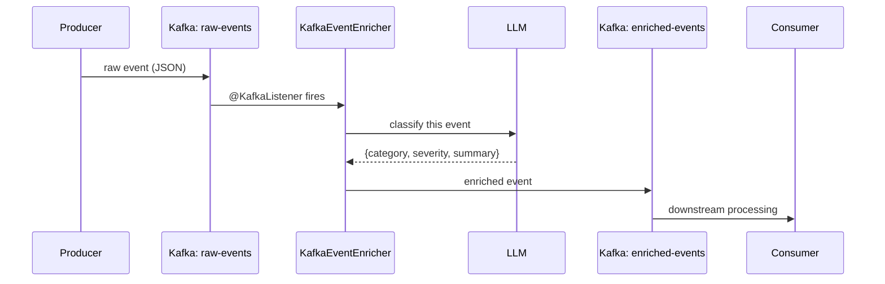
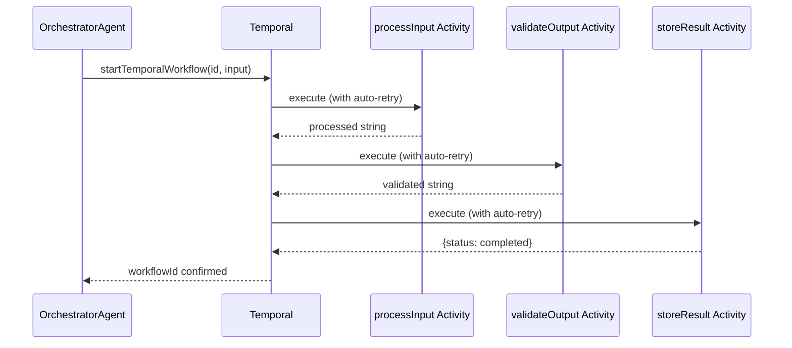

# Module 17 — Microservices Integration

> **Connecting AI agents to every major industry microservice pattern**

---

## 1. Learning Objectives

- Publish agent decisions to **RabbitMQ, Kafka, NATS, Pulsar, ActiveMQ, Azure Service Bus, AWS SQS/SNS, and Redis Streams** using the right transport for each use case
- Query **PostgreSQL, MongoDB, Cassandra, Elasticsearch, Neo4j, ClickHouse, and DynamoDB** directly from agent `@Tool` methods
- Implement **Redis semantic caching** to avoid redundant LLM calls, and **Hazelcast** for distributed shared agent state
- Call internal microservices via **gRPC, GraphQL, OpenFeign REST, and Dapr** service invocation
- Orchestrate **long-running agent workflows with Temporal** (durable, replayable, crash-proof)
- Route agent outputs through **Apache Camel (300+ connectors)**, **Spring Integration EIP pipelines**, and **CloudEvents** (CNCF standard envelope)

---

## 2. Prerequisites

- Completed **Module 16 – Knowledge Graph** (Neo4j concepts)
- Docker Desktop installed (all infra runs via `docker compose`)
- Java 21, Maven 3.9+
- `.env` file created from `.env.example`

---

## 3. Architecture

### Full Integration Map



### Kafka Event Enrichment Pipeline



### Temporal Durable Workflow



---

## 4. Key Concepts

### When to Use Which Queue

| Queue | Best For | Guarantee |
|---|---|---|
| RabbitMQ | Work queues, request/reply, routing | At-least-once, AMQP |
| Kafka | Event streaming, fan-out, replay, audit | At-least-once, ordered per partition |
| NATS | Ultra-low latency (<1ms), agent-to-agent RPC | At-most-once (JetStream = at-least-once) |
| Pulsar | Multi-tenant SaaS, geo-replicated, tiered storage | At-least-once |
| ActiveMQ | Legacy enterprise, JMS 2.0 compatibility | Exactly-once via XA transactions |
| Azure Service Bus | Azure-native, sessions, dead-letter | At-least-once |
| AWS SQS | Serverless, Lambda triggers, simple pull | At-least-once |
| Redis Streams | Lightweight Kafka alternative, built into Redis | At-least-once with consumer groups |
| Redis Pub/Sub | Real-time fire-and-forget broadcast | At-most-once |

### When to Use Which Database

| Database | Best For | Key Concept |
|---|---|---|
| PostgreSQL | ACID transactions, relational data, joins | Strong consistency, MVCC |
| MongoDB | Flexible schema, embedded documents, rapid iteration | Document model, horizontal sharding |
| Cassandra | High write throughput, time-series, IoT | Partition key design is critical |
| Elasticsearch | Full-text search, log analytics, aggregations | Inverted index, relevance scoring |
| Neo4j | Relationship traversal, knowledge graphs | Cypher query language, graph storage |
| ClickHouse | OLAP analytics, columnar scans, billions of rows | Columnar storage, vectorized execution |
| DynamoDB | Serverless key-value, AWS native, infinite scale | Partition key determines throughput |

### Redis Semantic Cache Pattern

```
User Prompt → SHA-256 Hash → Redis GETEX → HIT? Return cached LLM response
                                         → MISS? Call LLM → SETEX (30min TTL) → Return response
```

This pattern eliminates redundant LLM API calls for identical prompts, reducing cost by 40–80% in high-traffic agents.

### Temporal vs Kafka for Long-Running Tasks

- **Kafka**: durable event log, great for data pipelines, no native timeout/retry/state management at the workflow level
- **Temporal**: full workflow state machine — activities retry independently, timeouts per step, versioned workflow history, UI for inspection. Use Temporal when you need **business process guarantees** (approval chains, multi-step document processing, saga patterns).

---

## 5. How to Run

### Start all infrastructure

```bash
cd 17-microservices-integration
docker compose up -d
```

### Wait for health checks (first run ~2 minutes)

```bash
docker compose ps  # verify all services are healthy
```

### Run the application (local profile — uses Ollama)

```bash
cp .env.example .env   # edit as needed
./mvnw spring-boot:run -pl 17-microservices-integration -Plocal
```

### Run with OpenAI (cloud profile)

```bash
OPENAI_API_KEY=sk-xxx ./mvnw spring-boot:run -pl 17-microservices-integration -Pcloud
```

### Test via Swagger UI

Open http://localhost:8080/swagger-ui.html → `Microservices Integration Agent` section

### Example requests

```bash
# Get a JWT token first (use Module 07 auth endpoint or generate via shared/JwtUtil)

# List all available integrations
curl http://localhost:8080/api/v1/agents/microservices/integrations

# Chat with the agent
curl -X POST http://localhost:8080/api/v1/agents/microservices/chat \
  -H "Authorization: Bearer <JWT>" \
  -H "Content-Type: application/json" \
  -d '{"message": "Publish an order event to Kafka with type ORDER_PLACED and data {orderId: 123}"}'

curl -X POST http://localhost:8080/api/v1/agents/microservices/chat \
  -H "Authorization: Bearer <JWT>" \
  -H "Content-Type: application/json" \
  -d '{"message": "Query PostgreSQL for the schema and then find all users who signed up in the last 7 days"}'

curl -X POST http://localhost:8080/api/v1/agents/microservices/chat \
  -H "Authorization: Bearer <JWT>" \
  -H "Content-Type: application/json" \
  -d '{"message": "Search Elasticsearch index products for laptops under 1000 dollars"}'

curl -X POST http://localhost:8080/api/v1/agents/microservices/chat \
  -H "Authorization: Bearer <JWT>" \
  -H "Content-Type: application/json" \
  -d '{"message": "Start a Temporal workflow to process this document: lorem ipsum..."}'
```

---

## 6. Code Walkthrough

### Messaging Layer

| File | What it teaches |
|---|---|
| `RabbitMqTool` + `RabbitMqConfig` | AMQP topology: exchange, queue, binding, request/reply |
| `KafkaTool` + `KafkaEventEnricher` | Produce to topic + LLM-powered event enrichment consumer |
| `RedisStreamsTool` + `RedisPubSubTool` | Ordered persistent log vs fire-and-forget broadcast |
| `NatsTool` + `NatsConfig` | Sub-millisecond publish and synchronous request/reply |
| `PulsarTool` | Cloud-native multi-tenant streaming via Spring Pulsar |
| `ActiveMqTool` | JMS 2.0 queue and topic — legacy enterprise compatibility |
| `AzureServiceBusTool` | Azure SDK direct integration, message ID tracking |
| `SqsSnsTool` + `AwsClientConfig` | LocalStack-backed SQS pull queue + SNS fan-out |

### Database Layer

| File | What it teaches |
|---|---|
| `PostgresTool` | Schema inspection + guarded SELECT-only query execution |
| `MongoTool` | Collection discovery, find, insert via `MongoTemplate` |
| `CassandraTool` | CQL schema read + SELECT-only guard, partition key awareness |
| `ElasticsearchTool` | Multi-field search + document indexing via Elasticsearch Java client |
| `Neo4jTool` | Cypher MATCH guard + schema label/relationship discovery |
| `ClickHouseTool` | JDBC-based columnar OLAP queries with row cap |
| `DynamoDbTool` | GetItem, PutItem via AWS SDK v2 against LocalStack |

### Cache Layer

| File | What it teaches |
|---|---|
| `RedisSemanticCacheTool` | SHA-256 prompt hashing, GET/SETEX pattern for LLM response memoization |
| `HazelcastTool` + `HazelcastConfig` | Distributed in-memory grid, partition-aware TTL maps |

### Service Mesh Layer

| File | What it teaches |
|---|---|
| `inventory.proto` + `GrpcInventoryTool` | Protobuf schema, gRPC client injection, CheckStock + Reserve |
| `GraphQlTool` | WebClient-based GraphQL POST, field-selective queries |
| `ExternalServiceTool` + Feign clients | `@FeignClient` interface-driven HTTP, fallback-ready |
| `DaprTool` | Pub/sub and service invocation via Dapr SDK |
| `TemporalTool` + Workflow/Activity | Durable workflow definition, activity retry, crash recovery |

### Enterprise Integration Layer

| File | What it teaches |
|---|---|
| `AgentCamelRoutes` | `RouteBuilder` DSL: transform, multicast, dead-letter, error handler |
| `CamelRouteTool` | `ProducerTemplate` for programmatic Camel route invocation |
| `IntegrationConfig` + `SpringIntegrationTool` | `IntegrationFlow` DSL: filter, transform, router, channel |
| `CloudEventsTool` | CloudEvents v1.0 envelope construction + Kafka publish |

---

## 7. Common Pitfalls

- **Cassandra query without partition key**: full-table scans are disabled by default (`ALLOW FILTERING` required but dangerous in production). Always use the partition key in WHERE.
- **Kafka consumer group ID conflicts**: two different consumers sharing a group ID will steal each other's messages. Name groups by service, not globally.
- **Redis Pub/Sub is not durable**: messages published when no subscriber is active are lost. Use Redis Streams or Kafka when you need persistence.
- **gRPC proto changes**: adding fields is backward compatible, removing or renaming fields breaks existing clients. Always evolve proto with care.
- **Temporal workflow versioning**: once a workflow version is deployed, you cannot change activity logic mid-execution without a `Workflow.getVersion()` guard.
- **DynamoDB hot partitions**: if all writes go to the same partition key, throughput is throttled. Design keys with high cardinality (UUID, user ID).
- **Feign timeouts**: default Feign timeout is 1 second. Set `connectTimeout` and `readTimeout` explicitly for agent tools that call slow services.
- **CloudEvents data field**: must be a `byte[]`, not a `String`. Wrap your JSON payload with `.getBytes()` before building the CloudEvent.

---

## 8. Further Reading

- [RabbitMQ AMQP Tutorials](https://www.rabbitmq.com/tutorials)
- [Apache Kafka Documentation](https://kafka.apache.org/documentation/)
- [NATS Documentation](https://docs.nats.io/)
- [Apache Pulsar Documentation](https://pulsar.apache.org/docs/)
- [Apache Camel Component Reference](https://camel.apache.org/components/latest/)
- [Spring Integration Reference](https://docs.spring.io/spring-integration/reference/)
- [Temporal Java SDK](https://docs.temporal.io/dev-guide/java)
- [Dapr Java SDK](https://docs.dapr.io/developing-applications/sdks/java/)
- [CloudEvents Specification](https://cloudevents.io/)
- [AWS LocalStack](https://docs.localstack.cloud/)

---

## 9. What's Next

This is the final integration module. You have now built a complete, production-grade AI Agent platform covering:

1. LLM API basics → prompt engineering → structured output → tool calling
2. RAG → memory → API management → observability → guardrails
3. Multi-agent supervisor → LangChain4j → evaluation → deployment
4. MCP server → multi-LLM providers → knowledge graph → **microservices integration**

**Next steps for production:**
- Apply Module 13 (Deployment) patterns: Kubernetes Helm chart, HPA for the agent pod
- Add Module 07's Redis-backed Bucket4j to this module for multi-instance rate limiting
- Wire Module 08's distributed tracing to propagate trace IDs across all messaging transports
