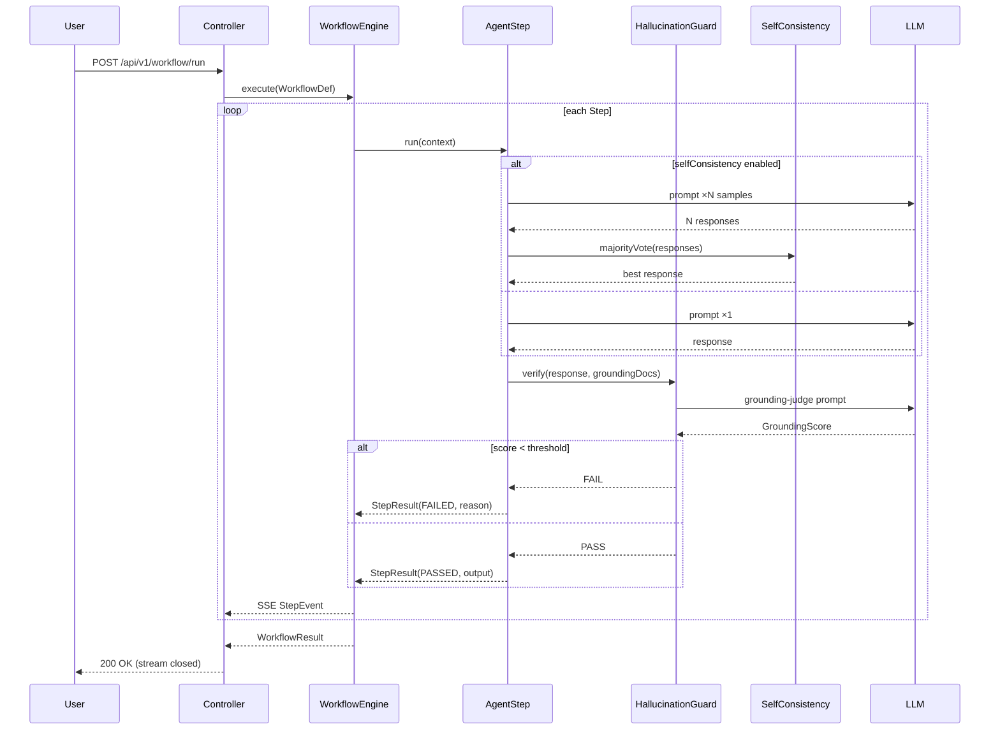
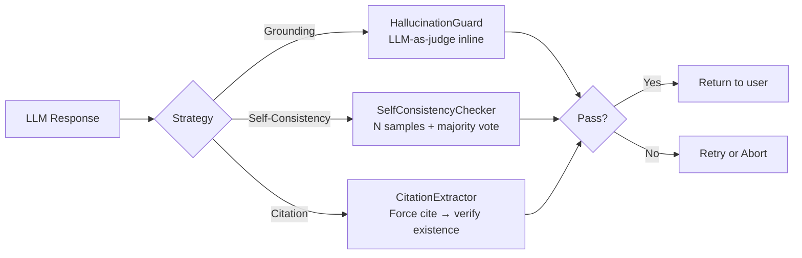

# Module 18 — Anti-Hallucination & Workflow Harness

> **Prerequisite**: [Module 17 — Microservices Integration](../17-microservices-integration/README.md)

## Learning Objectives

- Understand why hallucination occurs and the three runtime strategies to combat it.
- Build an inline `HallucinationGuard` that blocks ungrounded responses before they reach the user.
- Implement self-consistency sampling (N-sample majority vote) to stabilise non-deterministic outputs.
- Design a structured `WorkflowEngine` that chains agent steps with validation gates between them.
- Stream step-by-step progress to the client via Server-Sent Events.

## Prerequisites

- Modules 01–17 completed (JWT auth, rate limiting, observability all wired from `shared/`).
- `OPENAI_API_KEY` or Ollama running locally.
- Redis running (rate limit + optional result cache).

## Architecture

### Workflow execution with inline hallucination guard



### Three anti-hallucination strategies



## Key Concepts

### Why runtime guards, not just offline eval?

Module 12 runs an offline eval harness against a golden dataset after a release. That is useful for regression detection but it doesn't help users who hit a hallucination _right now_. Runtime guards intercept each response inline — they add latency but prevent bad answers from ever reaching the user.

### Grounding-based hallucination detection

The `HallucinationGuard` re-uses the LLM-as-judge pattern from Module 12, but in-band. It sends the original question, the grounding documents, and the candidate response to a judge prompt that returns a `GroundingScore` with `faithfulness` (0–1) and `confidence` (0–1). If either falls below a configurable threshold the step fails and the workflow can retry or abort.

Key design choice: use a cheaper/faster model for the judge (e.g. `gpt-4o-mini` or `llama3.2:1b`) so the guard doesn't double the cost of an expensive primary call.

### Self-consistency sampling

For non-deterministic steps (creative generation, reasoning chains) the `SelfConsistencyChecker` runs the same prompt N times (default 3) with `temperature=0.7` and selects the response that has the highest semantic similarity to the majority cluster. This is the technique from Wang et al. (2022) — it significantly reduces answer variance at the cost of 3× token usage, so use it selectively.

### Structured workflow with context propagation

The `WorkflowEngine` executes `StepDef` entries in order. Each step can read from and write to a shared `WorkflowContext` map. Steps are typed:

| Step type | What it does |
|---|---|
| `AGENT` | Calls LLM with optional tools, result stored in context |
| `GUARD` | Runs `HallucinationGuard` on a previous step's output |
| `TRANSFORM` | Applies a pure-Java function to context values (no LLM call) |
| `HUMAN_PAUSE` | Emits an SSE pause event and waits for `/workflow/{id}/resume` |

### SSE streaming

The controller returns `Flux<ServerSentEvent<StepEvent>>`. Each time a step completes (pass or fail) an event is emitted so the frontend can show a live progress indicator — essential for long workflows that take tens of seconds.

## How to Run

```bash
# Local (Ollama)
./mvnw -pl 18-anti-hallucination-workflow spring-boot:run -Plocal

# Cloud (OpenAI)
export OPENAI_API_KEY=sk-...
./mvnw -pl 18-anti-hallucination-workflow spring-boot:run -Pcloud

# Run a workflow (grounding enabled, self-consistency off)
curl -N -H "Authorization: Bearer $JWT" \
     -H "Content-Type: application/json" \
     -H "Accept: text/event-stream" \
     -d @src/test/resources/sample-workflow.json \
     http://localhost:8080/api/v1/workflow/run

# Run a workflow (self-consistency, 3 samples)
curl -N -H "Authorization: Bearer $JWT" \
     -H "Content-Type: application/json" \
     -H "Accept: text/event-stream" \
     -d @src/test/resources/self-consistency-workflow.json \
     http://localhost:8080/api/v1/workflow/run
```

## Code Walkthrough

| File | Purpose |
|---|---|
| `domain/WorkflowDef.java` | Record: workflow name + ordered list of `StepDef` |
| `domain/StepDef.java` | Record: step type, prompt template, grounding docs, consistency samples |
| `domain/StepResult.java` | Record: step name, status (PASSED/FAILED/SKIPPED), output, score |
| `domain/WorkflowResult.java` | Record: overall status, list of `StepResult`, total duration |
| `guard/GroundingScore.java` | Record: faithfulness, confidence, explanation |
| `guard/HallucinationGuard.java` | Calls judge LLM; returns `GroundingScore`; blocks if below threshold |
| `guard/SelfConsistencyChecker.java` | Runs N samples; selects majority via cosine similarity cluster |
| `guard/CitationExtractor.java` | Forces citation format in prompt; verifies citations exist in grounding docs |
| `workflow/WorkflowContext.java` | Thread-safe context map passed between steps |
| `workflow/AgentStep.java` | Executes one `StepDef` against the LLM; applies guard + consistency |
| `workflow/WorkflowEngine.java` | Orchestrates steps; emits `Flux<StepEvent>`; handles retry/abort |
| `controller/WorkflowController.java` | SSE endpoint; wires JWT auth + rate limit from `shared/` |
| `config/AntiHallucinationConfig.java` | Thresholds, sample count, judge model — all in `application.yml` |

## Common Pitfalls

- **Judge model must be different from generator model** — using the same model as both generator and judge creates a blind spot; it will score its own hallucinations as faithful.
- **Self-consistency is expensive** — 3 samples = 3× cost. Gate it behind a `consistencySamples > 1` check and only enable for high-stakes steps.
- **Grounding docs must be trimmed** — the judge prompt includes the grounding docs verbatim. Sending 100 KB of context blows the context window. Chunk and retrieve only what's relevant to the step's question.
- **SSE clients need `Accept: text/event-stream`** — without it Spring will buffer the whole response and stream nothing.
- **HUMAN_PAUSE requires persistent workflow state** — the workflow ID and context must survive a JVM restart. Store them in Redis (key: `workflow:{id}:context`).
- **Threshold tuning** — a faithfulness threshold of 0.7 is a starting point. Tune it per domain using Module 12's offline eval results.

## Further Reading

- [Self-Consistency Improves Chain of Thought Reasoning in Language Models — Wang et al. 2022](https://arxiv.org/abs/2203.11171)
- [RAGAS: Automated Evaluation of Retrieval Augmented Generation](https://arxiv.org/abs/2309.15217)
- [Spring AI Advisors](https://docs.spring.io/spring-ai/reference/api/advisors.html)
- [Project Reactor — Server-Sent Events](https://projectreactor.io/docs/core/release/reference/)
- [Structured Output in Spring AI](https://docs.spring.io/spring-ai/reference/api/structured-output-converter.html)

## What's Next

You've now built production-grade anti-hallucination guards and a structured workflow harness. In a real deployment you would combine this module with Module 05 (RAG) to supply grounding documents dynamically, and Module 08 (Observability) to track guard pass/fail rates in Grafana.
