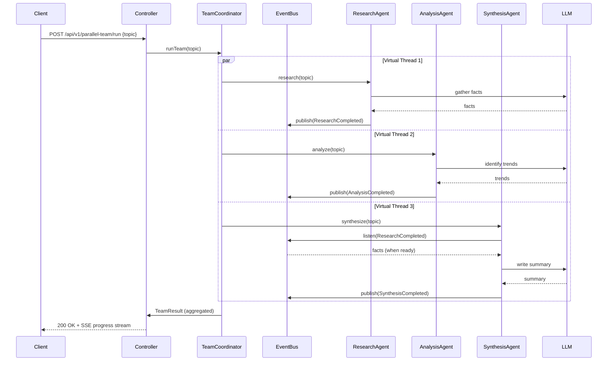
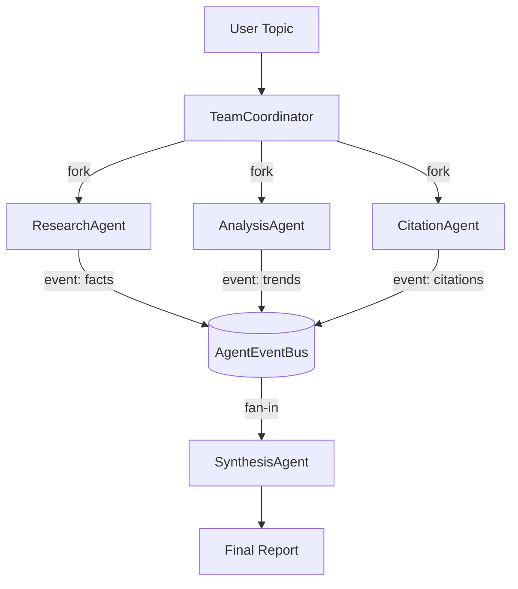

# Module 19 – Parallel Agent Teams

## Learning Objectives
- Launch multiple specialized agents concurrently using Java 21 Virtual Threads and `CompletableFuture`
- Design an event-driven inter-agent communication channel so agents share discoveries without blocking each other
- Implement a fan-out / fan-in coordinator that aggregates partial results as they arrive
- Stream live progress to the client via Server-Sent Events (SSE) while agents run in parallel
- Understand when parallelism helps (I/O-bound LLM calls) and when it hurts (token-quota contention)

## Prerequisites
- Module 10 (Multi-Agent Supervisor) — understand the supervisor pattern first
- Module 08 (Observability) — traces and metrics are extended here for parallel spans
- Running infra: `docker compose up -d` from repo root (Redis required for shared event bus)

## Architecture





## Key Concepts

### Java 21 Virtual Threads for LLM Parallelism
LLM calls are I/O-bound — the JVM thread just waits for the HTTP response. Virtual threads are ideal: they park cheaply during I/O, letting you run hundreds of concurrent agent calls on a handful of OS threads. Enable with `spring.threads.virtual.enabled=true`.

### Event-Driven Inter-Agent Communication
Agents publish `AgentEvent` records to a shared `AgentEventBus`. Other agents can subscribe to event types without direct coupling. The bus uses a `SubmissionPublisher<AgentEvent>` (Java Flow API) backed by virtual-thread executors — no blocking, no shared mutable state.

### Fan-Out / Fan-In with CompletableFuture
`TeamCoordinator` launches all agents via `CompletableFuture.supplyAsync()` on a virtual-thread executor, then uses `CompletableFuture.allOf()` to fan-in. Partial results stream to the client via SSE as each future completes.

### Structured Concurrency (Preview)
For agents that form a logical unit of work, `StructuredTaskScope.ShutdownOnFailure` cancels siblings if one agent fails — preventing wasted LLM token spend.

## How to Run

```bash
# Start infra
docker compose up -d

# Local profile (Ollama)
./mvnw spring-boot:run -pl 19-parallel-agent-teams -Plocal

# Cloud profile (OpenAI)
OPENAI_API_KEY=sk-... ./mvnw spring-boot:run -pl 19-parallel-agent-teams -Pcloud

# Run the team on a topic
curl -X POST http://localhost:8080/api/v1/parallel-team/run \
  -H "Authorization: Bearer $JWT" \
  -H "Content-Type: application/json" \
  -d '{"topic": "Impact of AI on software engineering jobs"}'

# SSE progress stream
curl -N http://localhost:8080/api/v1/parallel-team/stream/JOB_ID \
  -H "Authorization: Bearer $JWT"
```

## Code Walkthrough

| File | Purpose |
|---|---|
| `AgentEvent.java` | Sealed interface + record variants for each agent's output |
| `AgentEventBus.java` | `SubmissionPublisher`-based in-process event bus |
| `ResearchAgent.java` | Gathers factual information; publishes `ResearchCompleted` |
| `AnalysisAgent.java` | Identifies trends; publishes `AnalysisCompleted` |
| `CitationAgent.java` | Finds supporting sources; publishes `CitationCompleted` |
| `SynthesisAgent.java` | Waits for upstream events, writes final report |
| `TeamCoordinator.java` | Fan-out launch, fan-in aggregation, job state tracking |
| `ParallelTeamController.java` | REST + SSE endpoints |
| `JobStore.java` | In-memory ConcurrentHashMap of running/completed jobs |

## Common Pitfalls
- **Token quota contention**: launching 4 agents simultaneously quadruples token spend — set per-team rate limits separate from per-user limits
- **Silent agent failure**: if one `CompletableFuture` throws and you only call `allOf().join()`, other agents keep spending tokens on a doomed job — use `ShutdownOnFailure`
- **Event ordering assumptions**: agents receive events asynchronously — never assume ResearchCompleted arrives before AnalysisCompleted; design for any order
- **SSE client disconnects**: always cancel the job's futures when the SSE connection closes; otherwise agents run and bill to completion with nobody reading
- **Virtual thread pinning**: avoid `synchronized` blocks inside agent calls — use `ReentrantLock` instead to prevent virtual thread pinning on carrier threads

## Further Reading
- [Java 21 Virtual Threads JEP 444](https://openjdk.org/jeps/444)
- [Java Structured Concurrency JEP 453](https://openjdk.org/jeps/453)
- [Java Flow API (Reactive Streams)](https://docs.oracle.com/en/java/api/java.base/java/util/concurrent/Flow.html)
- [Spring AI ChatClient](https://docs.spring.io/spring-ai/reference/api/chatclient.html)

## What's Next
→ **Module 20 – AI Security**: secure your agents against prompt injection, jailbreaks, PII leakage, and the OWASP LLM Top 10
