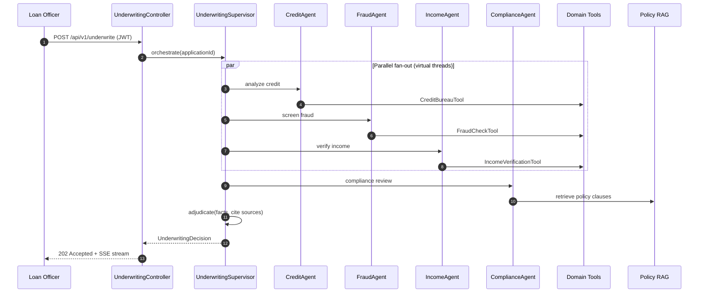

# 21 — Capstone: Loan Underwriting Platform

A **fully runnable, production-grade** AI underwriting system that combines every technique in the masterclass. A loan officer submits an application; a supervisor agent fans out to four specialist agents (credit, fraud, income, compliance), each wielding domain tools and policy RAG, then adjudicates a final decision with citations.

## Learning Objectives
- Compose supervisor + parallel specialist agents into one coherent system
- Wire JWT auth, per-user rate limiting, OpenTelemetry tracing, Prometheus metrics, and Resilience4j retries as a cohesive API management stack
- Enforce citation-backed outputs (anti-hallucination) for decisions that actually matter
- Run golden-dataset evaluation as a proper integration test
- Ship a real domain workflow rather than a toy demo

## Prerequisites
- Completed modules 01–20 (this module assumes fluency with every prior concept)
- Docker Desktop running (for Ollama / Prometheus / Grafana / Jaeger)
- JDK 21+, Maven 3.9+

## Architecture



## Key Concepts

**Supervisor pattern (from module 10).** The supervisor never calls an LLM for routing — it's deterministic Java. Only *final adjudication* uses an LLM, which is the decision that needs reasoning. Sub-agents never call each other.

**Parallel fan-out (module 19).** Credit, Fraud, Income all run on Java 21 virtual threads via `CompletableFuture.supplyAsync`. Compliance depends on the other three (needs their findings to cross-check policy), so it runs after fan-in.

**Citation-enforced adjudication (module 18).** The final decision prompt requires every rationale bullet to cite a specific finding ID (`CR-001`, `FR-002`, `POL-§3.2`). A `CitationValidator` rejects any decision where rationales can't be traced back to collected evidence.

**Multi-LLM routing (module 15).** Specialist agents use a fast/cheap model (`gpt-4o-mini` on cloud, `llama3.2` locally). The supervisor's adjudication uses a stronger model (`gpt-4o` on cloud) because the decision is high-stakes and low-volume.

## How to Run

```bash
# 1. Start infra (Ollama, Redis, Prometheus, Grafana, Jaeger)
docker compose -f ../docker-compose.yml up -d

# 2. Pull the local model once
docker exec masterclass-ollama ollama pull llama3.2

# 3. Run the app (local profile uses Ollama)
./mvnw -pl 21-capstone-loan-underwriting spring-boot:run

# Cloud profile (needs OPENAI_API_KEY):
./mvnw -pl 21-capstone-loan-underwriting spring-boot:run -Pcloud
```

Then:
```bash
# Get a demo token (dev endpoint, cloud profile should disable it)
TOKEN=$(curl -s -X POST localhost:8080/auth/login \
  -H "Content-Type: application/json" \
  -d '{"username":"officer1","password":"demo"}' | jq -r .token)

# Submit a loan application for underwriting
curl -X POST localhost:8080/api/v1/underwrite \
  -H "Authorization: Bearer $TOKEN" \
  -H "Content-Type: application/json" \
  -d '{"applicantId":"APP-001","loanAmount":250000,"termMonths":360,"purpose":"HOME_PURCHASE"}'

# Stream progress
curl -N -H "Authorization: Bearer $TOKEN" \
  localhost:8080/api/v1/underwrite/{jobId}/stream
```

## Code Walkthrough

| Layer | Package | Purpose |
|---|---|---|
| Controller | `controller/` | HTTP surface, SSE, auth demo endpoint |
| Orchestration | `service/` | `UnderwritingOrchestrator` runs parallel fan-out, final adjudication, citation validation |
| Agents | `agent/` | One LLM-backed `ChatClient` per specialist + `UnderwritingSupervisor` adjudicator |
| Tools | `tool/` | `@Tool`-annotated domain operations — credit pull, fraud score, income verify, policy retrieval |
| Domain | `domain/` | Records for application, findings, decision |
| Repository | `repository/` | In-memory stores seeded from `data/applicants.json` |
| Guardrails | `guardrails/` | `CitationValidator` enforces traceable rationales |
| Events | `event/` | `UnderwritingEvent` sealed hierarchy + `AgentEventBus` (adapted from module 19) |

## Common Pitfalls
- **Seeded data is in-memory.** Restart wipes it — fine for a capstone, not for prod.
- **Rate limiting is per-user.** Hitting the endpoint many times from the same JWT will 429. This is correct.
- **Citation validation rejects vague decisions.** If the LLM writes "applicant has strong credit" without `CR-xxx`, the decision is rejected and the orchestrator logs a `DecisionRejected` event. This is the feature, not a bug.
- **Ollama models vary.** Smaller quantizations (`llama3.2:1b`) may fail citation enforcement. Use the default 3B+.

## Further Reading
- Spring AI Tool Calling: https://docs.spring.io/spring-ai/reference/api/tools.html
- Spring AI Advisors: https://docs.spring.io/spring-ai/reference/api/advisors.html
- FCRA / fair-lending constraints on automated underwriting (US): 12 CFR §1002

## What's Next
This is the final module. Extensions worth building yourself: replace the in-memory repos with Postgres, swap the keyword policy retriever for pgvector, add a human-in-the-loop override endpoint, wire to a real credit bureau sandbox.
