# Java AI Agents Masterclass

> **Production-first masterclass for building AI agents in Java with Spring AI & LangChain4j — secure, observable, rate-limited, and enterprise-ready.**

[](https://github.com/kimhongzhang323/java-ai-agents-masterclass/actions)
[](LICENSE)
[](https://adoptium.net)
[](https://spring.io/projects/spring-boot)
[](https://spring.io/projects/spring-ai)
[](https://github.com/langchain4j/langchain4j)

## What This Is

Most AI agent tutorials teach you to build a chatbot. This masterclass teaches you to **ship one**.

Every module covers a real production concern that Python tutorials skip:

- JWT authentication + per-user API keys on every endpoint
- Rate limiting (Bucket4j) with `429 Too Many Requests` and `Retry-After` headers
- OpenTelemetry distributed tracing — see every LLM call and tool invocation in Jaeger
- Micrometer metrics — token usage, latency histograms, error rates in Grafana
- Input guardrails — prompt injection detection, PII redaction, content moderation
- Cost tracking — record token counts per user per request
- Retry + circuit breaker on LLM calls (Resilience4j)
- Structured output, RAG, multi-turn memory, multi-agent supervisor, evaluation

**Primary track**: Spring AI (Spring-native, `ChatClient`, advisors)  
**Secondary track**: LangChain4j (where its agentic module shines over Spring AI)

## Who This Is For

Enterprise Java developers (Spring Boot ecosystem) who want to move beyond "it works on my machine" and build AI features that can withstand production load, security review, and cost audits.

**Not for you if**: you want a five-minute Python notebook demo, or you're happy with no auth, no tracing, and no guardrails.

## Quickstart (3 commands)

```bash
git clone https://github.com/kimhongzhang323/java-ai-agents-masterclass.git
cd java-ai-agents-masterclass
docker compose up -d
./mvnw -pl 01-hello-agent spring-boot:run
```

Hit the API at [http://localhost:8080/swagger-ui.html](http://localhost:8080/swagger-ui.html)  
See traces at [http://localhost:16686](http://localhost:16686) (Jaeger)  
See dashboards at [http://localhost:3000](http://localhost:3000) (Grafana, admin/masterclass)

## Learning Path

```mermaid
flowchart LR
    P([00\nPrerequisites]) --> H([01\nHello Agent])
    H --> PR([02\nPrompt\nEngineering])
    PR --> SO([03\nStructured\nOutput])
    SO --> TC([04\nTool\nCalling])
    TC --> R([05\nRAG\nBasics])
    R --> M([06\nMemory &\nContext])
    M --> AM([07\nAPI\nManagement])
    AM --> OB([08\nObservability])
    OB --> G([09\nGuardrails])
    G --> MA([10\nMulti-Agent\nSupervisor])
    MA --> LC([11\nLangChain4j\nAgentic])
    LC --> EV([12\nEvaluation\n& Testing])
    EV --> DE([13\nDeployment])

    style AM fill:#f90,color:#000
    style OB fill:#f90,color:#000
    style G fill:#f90,color:#000
```



Highlighted in orange = the production differentiator modules. Every module before them already uses the full stack — those three modules explain it in depth.

## Module Index

| # | Module | Key Spring AI API | Key production concern |
|---|---|---|---|
| 00 | [Prerequisites](00-prerequisites/README.md) | — | Environment setup |
| 01 | [Hello Agent](01-hello-agent/README.md) | `ChatClient` | JWT + rate limit from day 1 |
| 02 | Prompt Engineering | `PromptTemplate` | Template injection prevention |
| 03 | Structured Output | `BeanOutputConverter` | Parse-failure retry |
| 04 | Tool Calling | `@Tool`, `ChatClient.tools()` | Tool-level circuit breaker |
| 05 | RAG Basics | `PgVectorStore`, `QuestionAnswerAdvisor` | Embedding cost tracking |
| 06 | Memory & Context | `ChatMemory`, `MessageChatMemoryAdvisor` | Session isolation |
| 07 | **API Management** | — | Full JWT/Bucket4j/OpenAPI/cost deep-dive |
| 08 | **Observability** | `ObservationRegistry` | OTel tracing, Grafana dashboards |
| 09 | **Guardrails** | Custom `Advisor` | Input/output safety, PII redaction |
| 10 | Multi-Agent Supervisor | `ChatClient` + tool delegation | Per-agent cost attribution |
| 11 | LangChain4j Agentic | `langchain4j-agentic` | Parallel workflows |
| 12 | Evaluation & Testing | LLM-as-judge | CI eval gate |
| 13 | Deployment | Jib, Helm | K8s, autoscaling, secret rotation |

## Example Projects

| Project | Concepts | "Show-stopper" feature |
|---|---|---|
| [customer-support-agent](examples/customer-support-agent/) | Tools + RAG + Memory + Guardrails | Cost-per-customer Grafana dashboard |
| [banking-assistant](examples/banking-assistant/) | Multi-agent + HITL approval | Human-in-the-loop transfer confirmation |
| [research-agent](examples/research-agent/) | LangChain4j agentic + parallel search | Cited markdown report generation |

## Tech Stack

```
Java 21+  ·  Spring Boot 3.3+  ·  Spring AI 1.0  ·  LangChain4j 0.35
Ollama (local)  ·  OpenAI / Anthropic / Gemini (cloud)
PGVector  ·  Redis  ·  Prometheus  ·  Grafana  ·  Jaeger
Bucket4j  ·  JJWT  ·  Resilience4j  ·  springdoc-openapi
Testcontainers  ·  WireMock
```

## Contributing

See [CONTRIBUTING.md](CONTRIBUTING.md). Every new module must pass the [SKILL.md](.claude/skills/java-ai-agents/SKILL.md) checklist before PR review.
