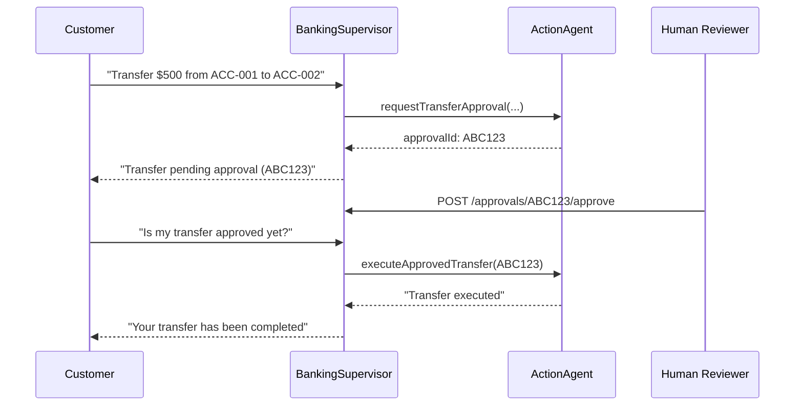

# Capstone — Banking Assistant

**Composes**: Module 06 (memory) + 07 (API mgmt) + 09 (guardrails) + 10 (multi-agent supervisor)

## What this demonstrates
A secure banking assistant with:
- Multi-agent supervisor routing to `AccountsAgent` (read) and `ActionAgent` (write)
- Human-in-the-loop (HITL) approval for all financial actions
- Admin-only endpoints for reviewers to approve/reject transfers
- Strict data isolation (one customer cannot access another's accounts)

## HITL Flow



## How to Run

```bash
./mvnw -pl examples/banking-assistant spring-boot:run -Plocal

# Customer chat
curl -X POST http://localhost:8080/api/v1/banking/chat \
  -H "Authorization: Bearer $USER_TOKEN" -H "Content-Type: application/json" \
  -d '{"message": "What is the balance on account ACC-001?"}'

# Initiate a transfer (supervisor routes to ActionAgent → creates approval)
curl -X POST http://localhost:8080/api/v1/banking/chat \
  -H "Authorization: Bearer $USER_TOKEN" -H "Content-Type: application/json" \
  -d '{"message": "Transfer $200 from ACC-001 to ACC-002 for customer CUST-42"}'
# Note the approvalId in the response

# Admin approves (requires ROLE_ADMIN JWT)
curl -X POST http://localhost:8080/api/v1/banking/approvals/ABC123/approve \
  -H "Authorization: Bearer $ADMIN_TOKEN"

# Customer checks result
curl -X POST http://localhost:8080/api/v1/banking/chat \
  -H "Authorization: Bearer $USER_TOKEN" -H "Content-Type: application/json" \
  -d '{"message": "Is approval ABC123 done? Please execute the transfer."}'
```
