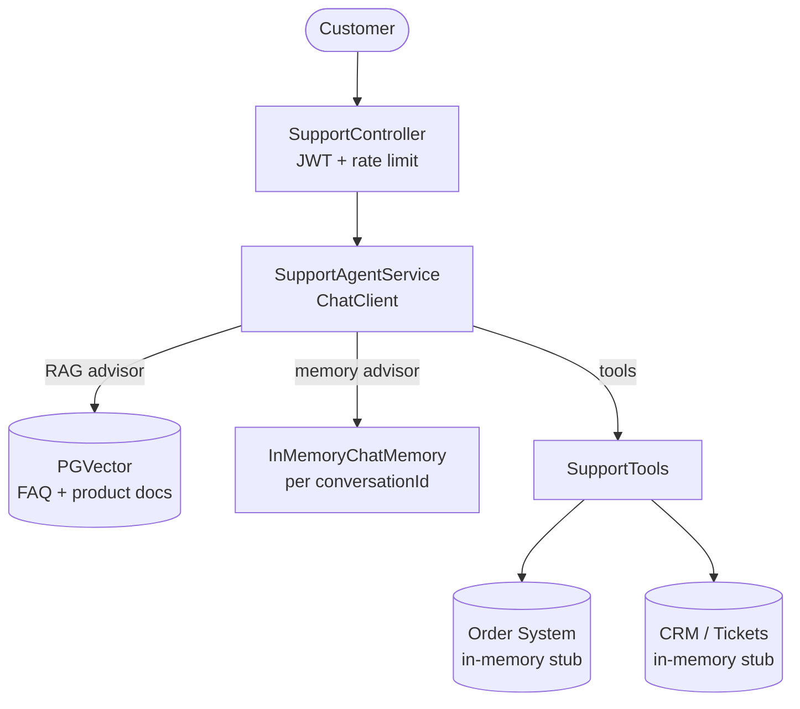

# Capstone — Customer Support Agent

**Composes**: Module 04 (tool-calling) + 05 (RAG) + 06 (memory) + 07 (API mgmt) + 09 (guardrails)

## What this demonstrates
A production-grade customer support bot that:
- Answers product questions from the knowledge base (RAG via PGVector)
- Looks up real order status and processes refunds via tools
- Maintains conversation history across turns (per-user session memory)
- Applies input guardrails (length + injection detection) and PII redaction on output

## Architecture



## How to Run

```bash
# Start infra
docker compose up -d pgvector redis

# Run (local Ollama profile)
./mvnw -pl examples/customer-support-agent spring-boot:run -Plocal

# Multi-turn conversation
TOKEN=$(curl -s -X POST http://localhost:8080/auth/token \
  -d '{"username":"user","password":"password"}' | jq -r .token)

# Turn 1
curl -X POST http://localhost:8080/api/v1/support/chat/session-1 \
  -H "Authorization: Bearer $TOKEN" -H "Content-Type: application/json" \
  -d '{"message": "Hi, what is the status of order ORD-001?"}'

# Turn 2 — agent remembers the order context
curl -X POST http://localhost:8080/api/v1/support/chat/session-1 \
  -H "Authorization: Bearer $TOKEN" -H "Content-Type: application/json" \
  -d '{"message": "Can I get a refund for it?"}'
```
