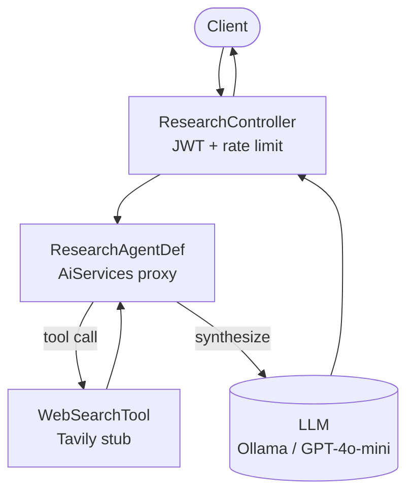

# Capstone — Research Agent (LangChain4j Agentic)

**Composes**: Module 11 (LangChain4j Agentic) + 08 (observability) + 09 (guardrails)

## What this demonstrates
A LangChain4j-powered research agent that:
- Uses a web search tool to gather real information (stubbed — swap in Tavily/SerpAPI)
- Synthesizes a cited, structured report in one fluent call via `AiServices`
- Proves the dual-track story: same Spring Boot security/observability stack, different AI framework

## Architecture



## How to Run

```bash
./mvnw -pl examples/research-agent spring-boot:run -Plocal

curl -X POST http://localhost:8080/api/v1/research/report \
  -H "Authorization: Bearer $TOKEN" -H "Content-Type: application/json" \
  -d '{"message": "the impact of AI on software engineering jobs in 2024"}'
```

## Swapping in a Real Search API

Replace `WebSearchTool.search()` with:

```java
// Tavily Search API
HttpResponse<String> resp = HttpClient.newHttpClient().send(
    HttpRequest.newBuilder()
        .uri(URI.create("https://api.tavily.com/search"))
        .header("Authorization", "Bearer " + tavilyApiKey)
        .POST(HttpRequest.BodyPublishers.ofString(
            """{"query":"%s","max_results":5}""".formatted(query)))
        .build(),
    HttpResponse.BodyHandlers.ofString());
// Parse the JSON response into List<String> snippets
```
